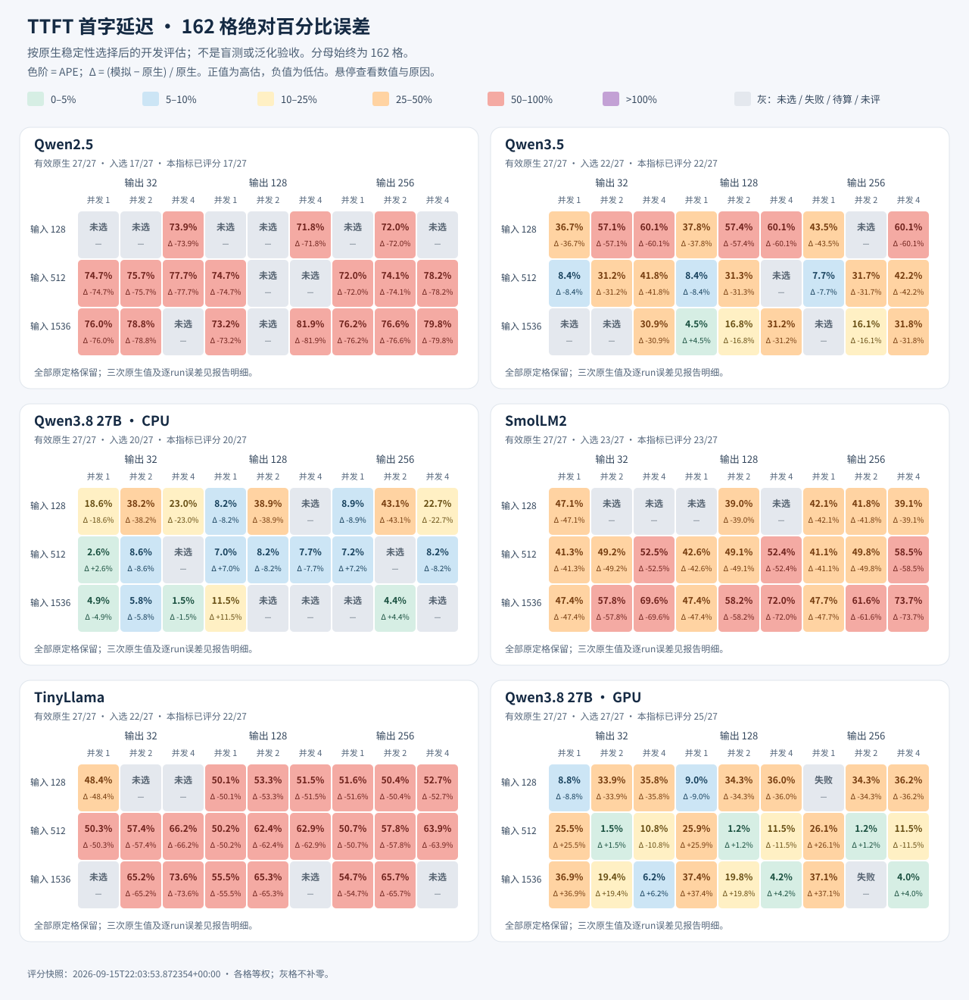
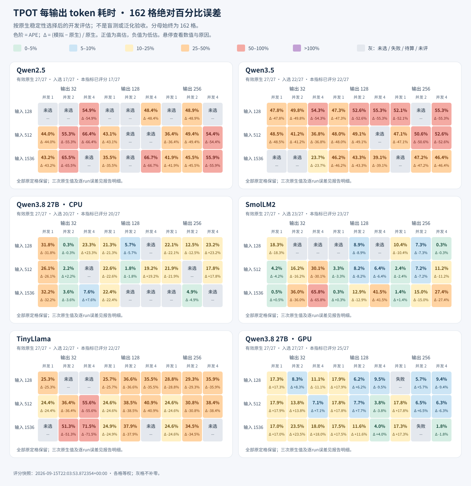
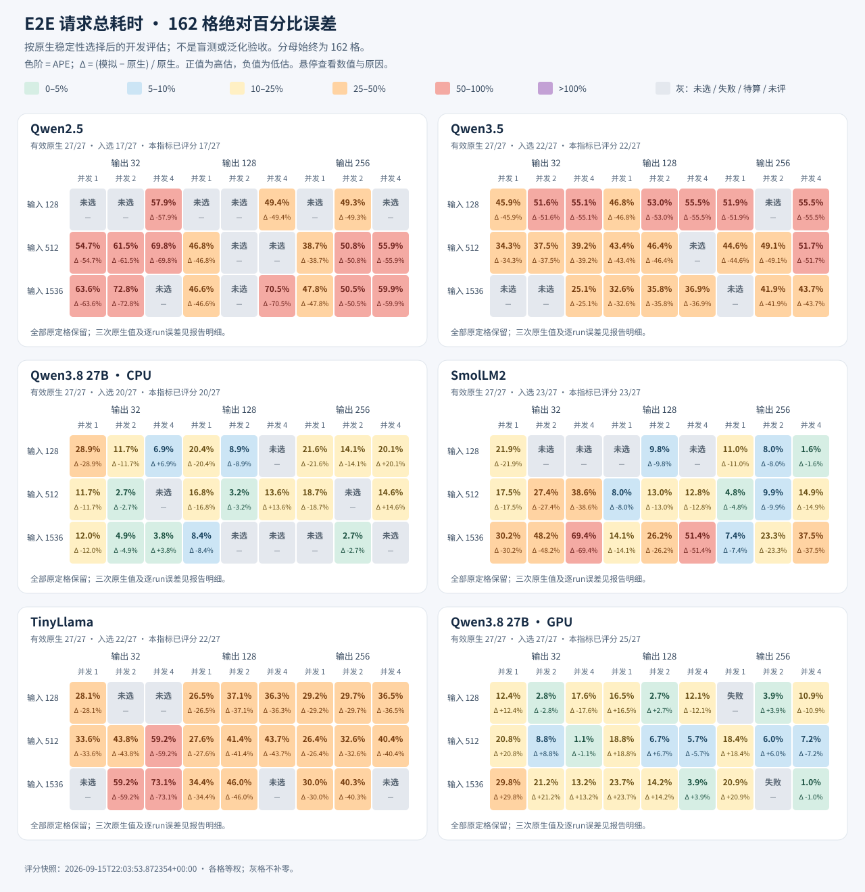

# 原生稳定样本开发评估

生成：2026-09-15T22:03:58.649737+00:00；评分：2026-09-15T22:03:53.872354+00:00

这是按原生稳定性选择后的开发评估，不是盲测，也不构成正式精度、跨进程重复性或泛化验收。选择只看原生 Engine 波动与有效覆盖，没有按模拟误差挑选格。

完整分母固定为原始 135 格加 27B GPU 版 27 格，共六组 162 格。每组保留 3 种输入 × 3 种输出 × 3 种并发；零入选组不能评估误差。

原生三次正式测量用于稳定性初筛；模拟为确定性单次预测。并发场景在每次原生运行内取请求中位数，再对三次run中位数取中位数；模拟侧取本次预测内请求中位数。

稳定入选门槛为三项指标的 batch 与请求序位最大绝对偏差均严格小于 5%，且证据完整有效。下方另列的三次run中位数最大偏差只是辅助展示，不替代选择器全部稳定性条件。

沿用 errors 的评分：有符号误差 Δ = 模拟 − 原生；APE = |Δ| / 原生 × 100%。逐run误差将同一个固定模拟值分别与原生三次值比较；R1/R2/R3 沿用评分文件保存的顺序。

统计按格等权，只对有效评分求中位数、线性插值 P90 和最大值。灰格不补零，每项统计公开已评分、稳定入选和原格分母；仅成功样本的条件误差不能代表全部 162 格。

本工具只读已有 JSON 与小型预测记录，核对记录身份及评分一致性；不读取模型、不运行预测、不修改原评分。机制限制取自预测记录，原生入选稳定不代表所有模拟机制已匹配。

> **硬件口径：** 4 格 SmolLM2 场景为用户授权频率例外下的新采集。仅这些格采用 2400 ± 60 MHz，原容差为 ±30 MHz；其他格保留各自原冻结门槛。这不表示原 freeze 的硬件门禁通过；原 162 格分母与旧失败历史均保留。

涉及场景：`smollm2_p128_o128_c2__fixed_runtime`, `smollm2_p1536_o128_c2__fixed_runtime`, `smollm2_p512_o128_c2__fixed_runtime`, `smollm2_p512_o32_c2__fixed_runtime`

## 完整覆盖

| 组别 | 原格 | 有效原生 | 稳定入选 | 本次冻结 | 预测成功 | 三项已评分 | 未选择 | 预测失败 | 待完成/未评 |
| --- | --- | --- | --- | --- | --- | --- | --- | --- | --- |
| Qwen2.5 | 27 | 27 | 17 | 17 | 17 | 17 | 10 | 0 | 0 |
| Qwen3.5 | 27 | 27 | 22 | 22 | 22 | 22 | 5 | 0 | 0 |
| Qwen3.8 27B · CPU | 27 | 27 | 20 | 20 | 20 | 20 | 7 | 0 | 0 |
| SmolLM2 | 27 | 27 | 23 | 23 | 23 | 23 | 4 | 0 | 0 |
| TinyLlama | 27 | 27 | 22 | 22 | 22 | 22 | 5 | 0 | 0 |
| Qwen3.8 27B · GPU | 27 | 27 | 27 | 27 | 25 | 25 | 0 | 2 | 0 |

原格 162；入选 131；未选择 31；保留历史失败尝试 14 条。有效原生数优先引用 coverage.verified_cells；未知值不补零。

## 全体已评分格的条件统计

| 指标 | 已评分 / 入选 / 原格 | APE 中位 / P90 / 最坏 (%) | 绝对误差 中位 / P90 / 最坏 (ms) | Δ中位 (%) | Δ中位 (ms) | Δ范围 (%) |
| --- | --- | --- | --- | --- | --- | --- |
| TTFT | 129 / 131 / 162 | 42.11 / 73.71 / 81.88 | 99.35 / 640.40 / 2638.83 | -42.11 | -48.98 | -81.88 至 +37.36 |
| TPOT | 129 / 131 / 162 | 24.59 / 52.97 / 71.54 | 2.56 / 44.46 / 125.82 | -24.59 | -1.58 | -71.54 至 +23.52 |
| E2E | 129 / 131 / 162 | 28.15 / 55.47 / 73.08 | 344.11 / 2833.74 / 25549.42 | -27.57 | -245.15 | -73.08 至 +29.82 |

## 六组误差

### Qwen2.5

| 指标 | 已评分 / 入选 / 原格 | APE 中位 / P90 / 最坏 (%) | 绝对误差 中位 / P90 / 最坏 (ms) | Δ中位 (%) | Δ中位 (ms) | Δ范围 (%) |
| --- | --- | --- | --- | --- | --- | --- |
| TTFT | 17 / 17 / 27 | 75.66 / 79.18 / 81.88 | 66.71 / 195.76 / 246.94 | -75.66 | -66.71 | -81.88 至 -71.79 |
| TPOT | 17 / 17 / 27 | 48.87 / 65.84 / 66.66 | 2.18 / 4.20 / 4.80 | -48.87 | -2.18 | -66.66 至 -35.53 |
| E2E | 17 / 17 / 27 | 54.68 / 70.09 / 72.77 | 308.54 / 821.80 / 1034.12 | -54.68 | -308.54 | -72.77 至 -38.65 |

- TTFT 最坏 APE 所在格：`qwen25_p1536_o128_c4__fixed_runtime`
- TPOT 最坏 APE 所在格：`qwen25_p1536_o128_c4__fixed_runtime`
- E2E 最坏 APE 所在格：`qwen25_p1536_o32_c2__fixed_runtime`

### Qwen3.5

| 指标 | 已评分 / 入选 / 原格 | APE 中位 / P90 / 最坏 (%) | 绝对误差 中位 / P90 / 最坏 (ms) | Δ中位 (%) | Δ中位 (ms) | Δ范围 (%) |
| --- | --- | --- | --- | --- | --- | --- |
| TTFT | 22 / 22 / 27 | 31.72 / 59.79 / 60.15 | 39.01 / 129.45 / 140.55 | -31.72 | -39.01 | -60.15 至 +4.46 |
| TPOT | 22 / 22 / 27 | 47.91 / 54.12 / 55.35 | 2.72 / 3.61 / 4.16 | -47.91 | -2.72 | -55.35 至 -23.68 |
| E2E | 22 / 22 / 27 | 45.25 / 54.92 / 55.49 | 382.96 / 944.06 / 1065.82 | -45.25 | -382.96 | -55.49 至 -25.10 |

- TTFT 最坏 APE 所在格：`qwen35_p128_o128_c4__fixed_runtime`
- TPOT 最坏 APE 所在格：`qwen35_p128_o256_c4__fixed_runtime`
- E2E 最坏 APE 所在格：`qwen35_p128_o128_c4__fixed_runtime`

### Qwen3.8 27B · CPU

| 指标 | 已评分 / 入选 / 原格 | APE 中位 / P90 / 最坏 (%) | 绝对误差 中位 / P90 / 最坏 (ms) | Δ中位 (%) | Δ中位 (ms) | Δ范围 (%) |
| --- | --- | --- | --- | --- | --- | --- |
| TTFT | 20 / 20 / 27 | 8.18 / 38.25 / 43.13 | 1286.50 / 1915.10 / 2638.83 | -8.16 | -937.83 | -43.13 至 +11.48 |
| TPOT | 20 / 20 / 27 | 20.26 / 26.64 / 32.18 | 56.58 / 105.12 / 125.82 | -5.30 | -22.31 | -32.18 至 +23.32 |
| E2E | 20 / 20 / 27 | 11.87 / 20.54 / 28.89 | 4145.60 / 15180.61 / 25549.42 | -8.61 | -2988.77 | -28.89 至 +20.11 |

- TTFT 最坏 APE 所在格：`qwen38_p128_o256_c2__fixed_runtime`
- TPOT 最坏 APE 所在格：`qwen38_p1536_o32_c1__fixed_runtime`
- E2E 最坏 APE 所在格：`qwen38_p128_o32_c1__fixed_runtime`

### SmolLM2

| 指标 | 已评分 / 入选 / 原格 | APE 中位 / P90 / 最坏 (%) | 绝对误差 中位 / P90 / 最坏 (ms) | Δ中位 (%) | Δ中位 (ms) | Δ范围 (%) |
| --- | --- | --- | --- | --- | --- | --- |
| TTFT | 23 / 23 / 27 | 49.12 / 68.04 / 73.67 | 57.57 / 318.87 / 447.04 | -49.12 | -57.57 | -73.67 至 -38.98 |
| TPOT | 23 / 23 / 27 | 8.85 / 34.80 / 65.79 | 0.42 / 2.80 / 11.73 | -8.85 | -0.42 | -65.79 至 +1.35 |
| E2E | 23 / 23 / 27 | 14.89 / 46.29 / 69.44 | 105.85 / 679.97 / 1192.81 | -14.89 | -105.85 | -69.44 至 -1.56 |

- TTFT 最坏 APE 所在格：`smollm2_p1536_o256_c4__fixed_runtime`
- TPOT 最坏 APE 所在格：`smollm2_p1536_o32_c4__fixed_runtime`
- E2E 最坏 APE 所在格：`smollm2_p1536_o32_c4__fixed_runtime`

### TinyLlama

| 指标 | 已评分 / 入选 / 原格 | APE 中位 / P90 / 最坏 (%) | 绝对误差 中位 / P90 / 最坏 (ms) | Δ中位 (%) | Δ中位 (ms) | Δ范围 (%) |
| --- | --- | --- | --- | --- | --- | --- |
| TTFT | 22 / 22 / 27 | 55.09 / 65.68 / 73.63 | 39.57 / 160.67 / 250.31 | -55.09 | -39.57 | -73.63 至 -48.41 |
| TPOT | 22 / 22 / 27 | 35.00 / 50.29 / 71.54 | 1.51 / 3.00 / 8.83 | -35.00 | -1.51 | -71.54 至 -24.36 |
| E2E | 22 / 22 / 27 | 36.40 / 57.84 / 73.08 | 254.15 / 518.44 / 538.92 | -36.40 | -254.15 | -73.08 至 -26.40 |

- TTFT 最坏 APE 所在格：`tinyllama_p1536_o32_c4__fixed_runtime`
- TPOT 最坏 APE 所在格：`tinyllama_p1536_o32_c4__fixed_runtime`
- E2E 最坏 APE 所在格：`tinyllama_p1536_o32_c4__fixed_runtime`

### Qwen3.8 27B · GPU

| 指标 | 已评分 / 入选 / 原格 | APE 中位 / P90 / 最坏 (%) | 绝对误差 中位 / P90 / 最坏 (ms) | Δ中位 (%) | Δ中位 (ms) | Δ范围 (%) |
| --- | --- | --- | --- | --- | --- | --- |
| TTFT | 25 / 27 / 27 | 19.79 / 36.65 / 37.36 | 132.74 / 472.22 / 528.10 | +1.20 | +9.63 | -36.22 至 +37.36 |
| TPOT | 25 / 27 / 27 | 11.07 / 17.91 / 23.52 | 4.17 / 4.99 / 16.27 | +8.27 | +4.00 | -11.07 至 +23.52 |
| E2E | 25 / 27 / 27 | 12.08 / 21.11 / 29.82 | 501.10 / 1082.08 / 1628.43 | +6.66 | +303.98 | -17.57 至 +29.82 |

- TTFT 最坏 APE 所在格：`qwen38_gpu_p1536_o128_c1__fixed_runtime`
- TPOT 最坏 APE 所在格：`qwen38_gpu_p1536_o32_c2__fixed_runtime`
- E2E 最坏 APE 所在格：`qwen38_gpu_p1536_o32_c1__fixed_runtime`

## 全部 162 格与排除原因

单格依次为 APE、Δ%、|Δ|ms；三次原生值和逐run误差见下一节。

| 组别 / Cell ID | 输入 / 输出 / 并发 | 状态 | TTFT | TPOT | E2E | 原因 |
| --- | --- | --- | --- | --- | --- | --- |
| Qwen2.5 / qwen25_p128_o32_c1__fixed_runtime | 128 / 32 / 1 | 未选择 | — | — | — | 原生波动未严格小于 5% [ttft_batch_worst_abs_pct_not_strictly_below_5]；原生波动未严格小于 5% [ttft_rank_worst_abs_pct_not_strictly_below_5] |
| Qwen2.5 / qwen25_p128_o32_c2__fixed_runtime | 128 / 32 / 2 | 未选择 | — | — | — | 原生波动未严格小于 5% [ttft_batch_worst_abs_pct_not_strictly_below_5]；原生波动未严格小于 5% [ttft_rank_worst_abs_pct_not_strictly_below_5] |
| Qwen2.5 / qwen25_p128_o32_c4__fixed_runtime | 128 / 32 / 4 | 已评分 | 73.87%; Δ-73.87%; 18.68ms | 54.90%; Δ-54.90%; 2.81ms | 57.85%; Δ-57.85%; 107.30ms | 三项评分可用 |
| Qwen2.5 / qwen25_p128_o128_c1__fixed_runtime | 128 / 128 / 1 | 未选择 | — | — | — | 原生波动未严格小于 5% [ttft_batch_worst_abs_pct_not_strictly_below_5]；原生波动未严格小于 5% [ttft_rank_worst_abs_pct_not_strictly_below_5]；原生波动未严格小于 5% [tpot_batch_worst_abs_pct_not_strictly_below_5]；原生波动未严格小于 5% [tpot_rank_worst_abs_pct_not_strictly_below_5]；原生波动未严格小于 5% [e2e_batch_worst_abs_pct_not_strictly_below_5]；原生波动未严格小于 5% [e2e_rank_worst_abs_pct_not_strictly_below_5] |
| Qwen2.5 / qwen25_p128_o128_c2__fixed_runtime | 128 / 128 / 2 | 未选择 | — | — | — | 原生波动未严格小于 5% [ttft_rank_worst_abs_pct_not_strictly_below_5] |
| Qwen2.5 / qwen25_p128_o128_c4__fixed_runtime | 128 / 128 / 4 | 已评分 | 71.79%; Δ-71.79%; 16.81ms | 48.39%; Δ-48.39%; 2.18ms | 49.38%; Δ-49.38%; 294.80ms | 三项评分可用 |
| Qwen2.5 / qwen25_p128_o256_c1__fixed_runtime | 128 / 256 / 1 | 未选择 | — | — | — | 原生波动未严格小于 5% [ttft_batch_worst_abs_pct_not_strictly_below_5]；原生波动未严格小于 5% [ttft_rank_worst_abs_pct_not_strictly_below_5] |
| Qwen2.5 / qwen25_p128_o256_c2__fixed_runtime | 128 / 256 / 2 | 已评分 | 71.96%; Δ-71.96%; 13.60ms | 48.87%; Δ-48.87%; 2.12ms | 49.25%; Δ-49.25%; 553.15ms | 三项评分可用 |
| Qwen2.5 / qwen25_p128_o256_c4__fixed_runtime | 128 / 256 / 4 | 未选择 | — | — | — | 原生波动未严格小于 5% [ttft_batch_worst_abs_pct_not_strictly_below_5]；原生波动未严格小于 5% [ttft_rank_worst_abs_pct_not_strictly_below_5] |
| Qwen2.5 / qwen25_p512_o32_c1__fixed_runtime | 512 / 32 / 1 | 已评分 | 74.74%; Δ-74.74%; 44.52ms | 44.00%; Δ-44.00%; 1.59ms | 54.68%; Δ-54.68%; 93.75ms | 三项评分可用 |
| Qwen2.5 / qwen25_p512_o32_c2__fixed_runtime | 512 / 32 / 2 | 已评分 | 75.66%; Δ-75.66%; 53.38ms | 55.30%; Δ-55.30%; 2.71ms | 61.54%; Δ-61.54%; 136.28ms | 三项评分可用 |
| Qwen2.5 / qwen25_p512_o32_c4__fixed_runtime | 512 / 32 / 4 | 已评分 | 77.72%; Δ-77.72%; 66.71ms | 66.39%; Δ-66.39%; 4.41ms | 69.80%; Δ-69.80%; 204.18ms | 三项评分可用 |
| Qwen2.5 / qwen25_p512_o128_c1__fixed_runtime | 512 / 128 / 1 | 已评分 | 74.68%; Δ-74.68%; 44.41ms | 43.12%; Δ-43.12%; 1.53ms | 46.77%; Δ-46.77%; 239.02ms | 三项评分可用 |
| Qwen2.5 / qwen25_p512_o128_c2__fixed_runtime | 512 / 128 / 2 | 未选择 | — | — | — | 原生波动未严格小于 5% [ttft_rank_worst_abs_pct_not_strictly_below_5] |
| Qwen2.5 / qwen25_p512_o128_c4__fixed_runtime | 512 / 128 / 4 | 未选择 | — | — | — | 原生波动未严格小于 5% [ttft_rank_worst_abs_pct_not_strictly_below_5] |
| Qwen2.5 / qwen25_p512_o256_c1__fixed_runtime | 512 / 256 / 1 | 已评分 | 72.04%; Δ-72.04%; 38.74ms | 36.45%; Δ-36.45%; 1.16ms | 38.65%; Δ-38.65%; 335.02ms | 三项评分可用 |
| Qwen2.5 / qwen25_p512_o256_c2__fixed_runtime | 512 / 256 / 2 | 已评分 | 74.06%; Δ-74.06%; 48.98ms | 49.45%; Δ-49.45%; 2.19ms | 50.77%; Δ-50.77%; 607.59ms | 三项评分可用 |
| Qwen2.5 / qwen25_p512_o256_c4__fixed_runtime | 512 / 256 / 4 | 已评分 | 78.22%; Δ-78.22%; 68.62ms | 54.38%; Δ-54.38%; 2.85ms | 55.87%; Δ-55.87%; 795.51ms | 三项评分可用 |
| Qwen2.5 / qwen25_p1536_o32_c1__fixed_runtime | 1536 / 32 / 1 | 已评分 | 76.03%; Δ-76.03%; 143.16ms | 43.21%; Δ-43.21%; 1.57ms | 63.62%; Δ-63.62%; 190.95ms | 三项评分可用 |
| Qwen2.5 / qwen25_p1536_o32_c2__fixed_runtime | 1536 / 32 / 2 | 已评分 | 78.76%; Δ-78.76%; 182.09ms | 65.48%; Δ-65.48%; 4.06ms | 72.77%; Δ-72.77%; 308.54ms | 三项评分可用 |
| Qwen2.5 / qwen25_p1536_o32_c4__fixed_runtime | 1536 / 32 / 4 | 未选择 | — | — | — | 原生波动未严格小于 5% [ttft_batch_worst_abs_pct_not_strictly_below_5]；原生波动未严格小于 5% [ttft_rank_worst_abs_pct_not_strictly_below_5]；原生波动未严格小于 5% [tpot_batch_worst_abs_pct_not_strictly_below_5]；原生波动未严格小于 5% [tpot_rank_worst_abs_pct_not_strictly_below_5]；原生波动未严格小于 5% [e2e_batch_worst_abs_pct_not_strictly_below_5]；原生波动未严格小于 5% [e2e_rank_worst_abs_pct_not_strictly_below_5] |
| Qwen2.5 / qwen25_p1536_o128_c1__fixed_runtime | 1536 / 128 / 1 | 已评分 | 73.22%; Δ-73.22%; 123.28ms | 35.53%; Δ-35.53%; 1.14ms | 46.58%; Δ-46.58%; 268.31ms | 三项评分可用 |
| Qwen2.5 / qwen25_p1536_o128_c2__fixed_runtime | 1536 / 128 / 2 | 未选择 | — | — | — | 原生波动未严格小于 5% [ttft_rank_worst_abs_pct_not_strictly_below_5]；原生波动未严格小于 5% [tpot_batch_worst_abs_pct_not_strictly_below_5]；原生波动未严格小于 5% [tpot_rank_worst_abs_pct_not_strictly_below_5]；原生波动未严格小于 5% [e2e_batch_worst_abs_pct_not_strictly_below_5]；原生波动未严格小于 5% [e2e_rank_worst_abs_pct_not_strictly_below_5] |
| Qwen2.5 / qwen25_p1536_o128_c4__fixed_runtime | 1536 / 128 / 4 | 已评分 | 81.88%; Δ-81.88%; 246.94ms | 66.66%; Δ-66.66%; 4.80ms | 70.51%; Δ-70.51%; 861.23ms | 三项评分可用 |
| Qwen2.5 / qwen25_p1536_o256_c1__fixed_runtime | 1536 / 256 / 1 | 已评分 | 76.23%; Δ-76.23%; 144.62ms | 41.91%; Δ-41.91%; 1.49ms | 47.80%; Δ-47.80%; 524.86ms | 三项评分可用 |
| Qwen2.5 / qwen25_p1536_o256_c2__fixed_runtime | 1536 / 256 / 2 | 已评分 | 76.63%; Δ-76.63%; 160.79ms | 45.54%; Δ-45.54%; 1.94ms | 50.50%; Δ-50.50%; 652.32ms | 三项评分可用 |
| Qwen2.5 / qwen25_p1536_o256_c4__fixed_runtime | 1536 / 256 / 4 | 已评分 | 79.82%; Δ-79.82%; 216.27ms | 55.90%; Δ-55.90%; 3.17ms | 59.89%; Δ-59.89%; 1034.12ms | 三项评分可用 |
| Qwen3.5 / qwen35_p128_o32_c1__fixed_runtime | 128 / 32 / 1 | 已评分 | 36.71%; Δ-36.71%; 10.31ms | 47.82%; Δ-47.82%; 2.11ms | 45.90%; Δ-45.90%; 75.58ms | 三项评分可用 |
| Qwen3.5 / qwen35_p128_o32_c2__fixed_runtime | 128 / 32 / 2 | 已评分 | 57.12%; Δ-57.12%; 30.75ms | 49.82%; Δ-49.82%; 2.81ms | 51.62%; Δ-51.62%; 118.09ms | 三项评分可用 |
| Qwen3.5 / qwen35_p128_o32_c4__fixed_runtime | 128 / 32 / 4 | 已评分 | 60.06%; Δ-60.06%; 52.90ms | 54.28%; Δ-54.28%; 4.16ms | 55.14%; Δ-55.14%; 181.70ms | 三项评分可用 |
| Qwen3.5 / qwen35_p128_o128_c1__fixed_runtime | 128 / 128 / 1 | 已评分 | 37.81%; Δ-37.81%; 10.81ms | 47.30%; Δ-47.30%; 2.07ms | 46.85%; Δ-46.85%; 273.27ms | 三项评分可用 |
| Qwen3.5 / qwen35_p128_o128_c2__fixed_runtime | 128 / 128 / 2 | 已评分 | 57.39%; Δ-57.39%; 31.09ms | 52.62%; Δ-52.62%; 2.87ms | 52.97%; Δ-52.97%; 394.98ms | 三项评分可用 |
| Qwen3.5 / qwen35_p128_o128_c4__fixed_runtime | 128 / 128 / 4 | 已评分 | 60.15%; Δ-60.15%; 53.10ms | 55.31%; Δ-55.31%; 3.68ms | 55.49%; Δ-55.49%; 519.67ms | 三项评分可用 |
| Qwen3.5 / qwen35_p128_o256_c1__fixed_runtime | 128 / 256 / 1 | 已评分 | 43.51%; Δ-43.51%; 13.69ms | 52.10%; Δ-52.10%; 2.50ms | 51.91%; Δ-51.91%; 652.93ms | 三项评分可用 |
| Qwen3.5 / qwen35_p128_o256_c2__fixed_runtime | 128 / 256 / 2 | 未选择 | — | — | — | 原生波动未严格小于 5% [ttft_batch_worst_abs_pct_not_strictly_below_5]；原生波动未严格小于 5% [ttft_rank_worst_abs_pct_not_strictly_below_5]；原生波动未严格小于 5% [tpot_batch_worst_abs_pct_not_strictly_below_5]；原生波动未严格小于 5% [tpot_rank_worst_abs_pct_not_strictly_below_5]；原生波动未严格小于 5% [e2e_batch_worst_abs_pct_not_strictly_below_5]；原生波动未严格小于 5% [e2e_rank_worst_abs_pct_not_strictly_below_5] |
| Qwen3.5 / qwen35_p128_o256_c4__fixed_runtime | 128 / 256 / 4 | 已评分 | 60.15%; Δ-60.15%; 53.10ms | 55.35%; Δ-55.35%; 3.58ms | 55.46%; Δ-55.46%; 967.15ms | 三项评分可用 |
| Qwen3.5 / qwen35_p512_o32_c1__fixed_runtime | 512 / 32 / 1 | 已评分 | 8.45%; Δ-8.45%; 6.46ms | 48.54%; Δ-48.54%; 2.18ms | 34.32%; Δ-34.32%; 73.94ms | 三项评分可用 |
| Qwen3.5 / qwen35_p512_o32_c2__fixed_runtime | 512 / 32 / 2 | 已评分 | 31.23%; Δ-31.23%; 38.56ms | 41.25%; Δ-41.25%; 2.62ms | 37.48%; Δ-37.48%; 120.20ms | 三项评分可用 |
| Qwen3.5 / qwen35_p512_o32_c4__fixed_runtime | 512 / 32 / 4 | 已评分 | 41.78%; Δ-41.78%; 77.79ms | 36.83%; Δ-36.83%; 3.60ms | 39.18%; Δ-39.18%; 194.93ms | 三项评分可用 |
| Qwen3.5 / qwen35_p512_o128_c1__fixed_runtime | 512 / 128 / 1 | 已评分 | 8.36%; Δ-8.36%; 6.38ms | 48.00%; Δ-48.00%; 2.13ms | 43.37%; Δ-43.37%; 278.20ms | 三项评分可用 |
| Qwen3.5 / qwen35_p512_o128_c2__fixed_runtime | 512 / 128 / 2 | 已评分 | 31.27%; Δ-31.27%; 38.63ms | 49.13%; Δ-49.13%; 2.72ms | 46.43%; Δ-46.43%; 383.10ms | 三项评分可用 |
| Qwen3.5 / qwen35_p512_o128_c4__fixed_runtime | 512 / 128 / 4 | 未选择 | — | — | — | 原生波动未严格小于 5% [ttft_batch_worst_abs_pct_not_strictly_below_5]；原生波动未严格小于 5% [ttft_rank_worst_abs_pct_not_strictly_below_5] |
| Qwen3.5 / qwen35_p512_o256_c1__fixed_runtime | 512 / 256 / 1 | 已评分 | 7.66%; Δ-7.66%; 5.81ms | 47.12%; Δ-47.12%; 2.06ms | 44.60%; Δ-44.60%; 530.67ms | 三项评分可用 |
| Qwen3.5 / qwen35_p512_o256_c2__fixed_runtime | 512 / 256 / 2 | 已评分 | 31.69%; Δ-31.69%; 39.38ms | 50.60%; Δ-50.60%; 2.73ms | 49.05%; Δ-49.05%; 736.22ms | 三项评分可用 |
| Qwen3.5 / qwen35_p512_o256_c4__fixed_runtime | 512 / 256 / 4 | 已评分 | 42.18%; Δ-42.18%; 79.08ms | 52.64%; Δ-52.64%; 3.61ms | 51.74%; Δ-51.74%; 1006.05ms | 三项评分可用 |
| Qwen3.5 / qwen35_p1536_o32_c1__fixed_runtime | 1536 / 32 / 1 | 未选择 | — | — | — | 原生波动未严格小于 5% [ttft_batch_worst_abs_pct_not_strictly_below_5]；原生波动未严格小于 5% [ttft_rank_worst_abs_pct_not_strictly_below_5] |
| Qwen3.5 / qwen35_p1536_o32_c2__fixed_runtime | 1536 / 32 / 2 | 未选择 | — | — | — | 原生波动未严格小于 5% [ttft_rank_worst_abs_pct_not_strictly_below_5]；原生波动未严格小于 5% [tpot_rank_worst_abs_pct_not_strictly_below_5] |
| Qwen3.5 / qwen35_p1536_o32_c4__fixed_runtime | 1536 / 32 / 4 | 已评分 | 30.89%; Δ-30.89%; 135.04ms | 23.68%; Δ-23.68%; 3.39ms | 25.10%; Δ-25.10%; 199.73ms | 三项评分可用 |
| Qwen3.5 / qwen35_p1536_o128_c1__fixed_runtime | 1536 / 128 / 1 | 已评分 | 4.46%; Δ+4.46%; 8.98ms | 46.21%; Δ-46.21%; 2.00ms | 32.63%; Δ-32.63%; 245.15ms | 三项评分可用 |
| Qwen3.5 / qwen35_p1536_o128_c2__fixed_runtime | 1536 / 128 / 2 | 已评分 | 16.79%; Δ-16.79%; 50.72ms | 43.29%; Δ-43.29%; 2.62ms | 35.76%; Δ-35.76%; 382.83ms | 三项评分可用 |
| Qwen3.5 / qwen35_p1536_o128_c4__fixed_runtime | 1536 / 128 / 4 | 已评分 | 31.25%; Δ-31.25%; 137.30ms | 39.14%; Δ-39.14%; 3.49ms | 36.86%; Δ-36.86%; 581.75ms | 三项评分可用 |
| Qwen3.5 / qwen35_p1536_o256_c1__fixed_runtime | 1536 / 256 / 1 | 未选择 | — | — | — | 原生波动未严格小于 5% [ttft_batch_worst_abs_pct_not_strictly_below_5]；原生波动未严格小于 5% [ttft_rank_worst_abs_pct_not_strictly_below_5] |
| Qwen3.5 / qwen35_p1536_o256_c2__fixed_runtime | 1536 / 256 / 2 | 已评分 | 16.06%; Δ-16.06%; 48.11ms | 47.22%; Δ-47.22%; 2.68ms | 41.88%; Δ-41.88%; 731.88ms | 三项评分可用 |
| Qwen3.5 / qwen35_p1536_o256_c4__fixed_runtime | 1536 / 256 / 4 | 已评分 | 31.75%; Δ-31.75%; 140.55ms | 46.42%; Δ-46.42%; 3.62ms | 43.73%; Δ-43.73%; 1065.82ms | 三项评分可用 |
| Qwen3.8 27B · CPU / qwen38_p128_o32_c1__fixed_runtime | 128 / 32 / 1 | 已评分 | 18.63%; Δ-18.63%; 489.35ms | 31.83%; Δ-31.83%; 91.92ms | 28.89%; Δ-28.89%; 3347.61ms | 三项评分可用 |
| Qwen3.8 27B · CPU / qwen38_p128_o32_c2__fixed_runtime | 128 / 32 / 2 | 已评分 | 38.17%; Δ-38.17%; 1634.70ms | 0.34%; Δ-0.34%; 1.11ms | 11.67%; Δ-11.67%; 1672.00ms | 三项评分可用 |
| Qwen3.8 27B · CPU / qwen38_p128_o32_c4__fixed_runtime | 128 / 32 / 4 | 已评分 | 23.00%; Δ-23.00%; 1532.43ms | 23.32%; Δ+23.32%; 125.82ms | 6.85%; Δ+6.85%; 1651.29ms | 三项评分可用 |
| Qwen3.8 27B · CPU / qwen38_p128_o128_c1__fixed_runtime | 128 / 128 / 1 | 已评分 | 8.16%; Δ-8.16%; 189.78ms | 21.32%; Δ-21.32%; 53.38ms | 20.42%; Δ-20.42%; 6967.34ms | 三项评分可用 |
| Qwen3.8 27B · CPU / qwen38_p128_o128_c2__fixed_runtime | 128 / 128 / 2 | 已评分 | 38.89%; Δ-38.89%; 1684.93ms | 5.68%; Δ-5.68%; 17.99ms | 8.86%; Δ-8.86%; 3940.38ms | 三项评分可用 |
| Qwen3.8 27B · CPU / qwen38_p128_o128_c4__fixed_runtime | 128 / 128 / 4 | 未选择 | — | — | — | 原生波动未严格小于 5% [ttft_rank_worst_abs_pct_not_strictly_below_5] |
| Qwen3.8 27B · CPU / qwen38_p128_o256_c1__fixed_runtime | 128 / 256 / 1 | 已评分 | 8.90%; Δ-8.90%; 208.67ms | 22.08%; Δ-22.08%; 55.84ms | 21.61%; Δ-21.61%; 14443.57ms | 三项评分可用 |
| Qwen3.8 27B · CPU / qwen38_p128_o256_c2__fixed_runtime | 128 / 256 / 2 | 已评分 | 43.13%; Δ-43.13%; 2007.93ms | 12.54%; Δ-12.54%; 42.23ms | 14.11%; Δ-14.11%; 12776.06ms | 三项评分可用 |
| Qwen3.8 27B · CPU / qwen38_p128_o256_c4__fixed_runtime | 128 / 256 / 4 | 已评分 | 22.70%; Δ-22.70%; 1506.18ms | 23.20%; Δ+23.20%; 108.91ms | 20.11%; Δ+20.11%; 25549.42ms | 三项评分可用 |
| Qwen3.8 27B · CPU / qwen38_p512_o32_c1__fixed_runtime | 512 / 32 / 1 | 已评分 | 2.61%; Δ+2.61%; 216.27ms | 26.06%; Δ-26.06%; 69.54ms | 11.70%; Δ-11.70%; 1939.45ms | 三项评分可用 |
| Qwen3.8 27B · CPU / qwen38_p512_o32_c2__fixed_runtime | 512 / 32 / 2 | 已评分 | 8.59%; Δ-8.59%; 962.94ms | 2.17%; Δ+2.17%; 9.09ms | 2.74%; Δ-2.74%; 663.69ms | 三项评分可用 |
| Qwen3.8 27B · CPU / qwen38_p512_o32_c4__fixed_runtime | 512 / 32 / 4 | 未选择 | — | — | — | 原生波动未严格小于 5% [ttft_batch_worst_abs_pct_not_strictly_below_5]；原生波动未严格小于 5% [ttft_rank_worst_abs_pct_not_strictly_below_5]；原生波动未严格小于 5% [tpot_batch_worst_abs_pct_not_strictly_below_5]；原生波动未严格小于 5% [tpot_rank_worst_abs_pct_not_strictly_below_5]；原生波动未严格小于 5% [e2e_batch_worst_abs_pct_not_strictly_below_5]；原生波动未严格小于 5% [e2e_rank_worst_abs_pct_not_strictly_below_5] |
| Qwen3.8 27B · CPU / qwen38_p512_o128_c1__fixed_runtime | 512 / 128 / 1 | 已评分 | 6.98%; Δ+6.98%; 556.00ms | 22.63%; Δ-22.63%; 57.72ms | 16.79%; Δ-16.79%; 6774.44ms | 三项评分可用 |
| Qwen3.8 27B · CPU / qwen38_p512_o128_c2__fixed_runtime | 512 / 128 / 2 | 已评分 | 8.18%; Δ-8.18%; 912.72ms | 1.81%; Δ-1.81%; 5.98ms | 3.20%; Δ-3.20%; 1701.60ms | 三项评分可用 |
| Qwen3.8 27B · CPU / qwen38_p512_o128_c4__fixed_runtime | 512 / 128 / 4 | 已评分 | 7.73%; Δ-7.73%; 1270.49ms | 19.19%; Δ+19.19%; 104.70ms | 13.64%; Δ+13.64%; 11786.94ms | 三项评分可用 |
| Qwen3.8 27B · CPU / qwen38_p512_o256_c1__fixed_runtime | 512 / 256 / 1 | 已评分 | 7.20%; Δ+7.20%; 572.32ms | 21.92%; Δ-21.92%; 55.44ms | 18.73%; Δ-18.73%; 13564.48ms | 三项评分可用 |
| Qwen3.8 27B · CPU / qwen38_p512_o256_c2__fixed_runtime | 512 / 256 / 2 | 未选择 | — | — | — | 原生波动未严格小于 5% [ttft_batch_worst_abs_pct_not_strictly_below_5]；原生波动未严格小于 5% [ttft_rank_worst_abs_pct_not_strictly_below_5]；原生波动未严格小于 5% [tpot_batch_worst_abs_pct_not_strictly_below_5]；原生波动未严格小于 5% [tpot_rank_worst_abs_pct_not_strictly_below_5]；原生波动未严格小于 5% [e2e_batch_worst_abs_pct_not_strictly_below_5]；原生波动未严格小于 5% [e2e_rank_worst_abs_pct_not_strictly_below_5] |
| Qwen3.8 27B · CPU / qwen38_p512_o256_c4__fixed_runtime | 512 / 256 / 4 | 已评分 | 8.17%; Δ-8.17%; 1349.62ms | 17.85%; Δ+17.85%; 92.25ms | 14.63%; Δ+14.63%; 21813.96ms | 三项评分可用 |
| Qwen3.8 27B · CPU / qwen38_p1536_o32_c1__fixed_runtime | 1536 / 32 / 1 | 已评分 | 4.85%; Δ-4.85%; 1306.84ms | 32.18%; Δ-32.18%; 94.12ms | 12.04%; Δ-12.04%; 4350.82ms | 三项评分可用 |
| Qwen3.8 27B · CPU / qwen38_p1536_o32_c2__fixed_runtime | 1536 / 32 / 2 | 已评分 | 5.85%; Δ-5.85%; 1904.78ms | 3.60%; Δ-3.60%; 26.63ms | 4.92%; Δ-4.92%; 2730.38ms | 三项评分可用 |
| Qwen3.8 27B · CPU / qwen38_p1536_o32_c4__fixed_runtime | 1536 / 32 / 4 | 已评分 | 1.50%; Δ-1.50%; 565.10ms | 7.61%; Δ+7.61%; 94.22ms | 3.82%; Δ+3.82%; 2700.02ms | 三项评分可用 |
| Qwen3.8 27B · CPU / qwen38_p1536_o128_c1__fixed_runtime | 1536 / 128 / 1 | 已评分 | 11.48%; Δ+11.48%; 2638.83ms | 22.41%; Δ-22.41%; 57.31ms | 8.36%; Δ-8.36%; 4638.14ms | 三项评分可用 |
| Qwen3.8 27B · CPU / qwen38_p1536_o128_c2__fixed_runtime | 1536 / 128 / 2 | 未选择 | — | — | — | 原生波动未严格小于 5% [ttft_batch_worst_abs_pct_not_strictly_below_5]；原生波动未严格小于 5% [ttft_rank_worst_abs_pct_not_strictly_below_5] |
| Qwen3.8 27B · CPU / qwen38_p1536_o128_c4__fixed_runtime | 1536 / 128 / 4 | 未选择 | — | — | — | 原生波动未严格小于 5% [ttft_batch_worst_abs_pct_not_strictly_below_5]；原生波动未严格小于 5% [ttft_rank_worst_abs_pct_not_strictly_below_5]；原生波动未严格小于 5% [tpot_rank_worst_abs_pct_not_strictly_below_5]；原生波动未严格小于 5% [e2e_rank_worst_abs_pct_not_strictly_below_5] |
| Qwen3.8 27B · CPU / qwen38_p1536_o256_c1__fixed_runtime | 1536 / 256 / 1 | 未选择 | — | — | — | 原生波动未严格小于 5% [ttft_batch_worst_abs_pct_not_strictly_below_5]；原生波动未严格小于 5% [ttft_rank_worst_abs_pct_not_strictly_below_5]；原生波动未严格小于 5% [tpot_batch_worst_abs_pct_not_strictly_below_5]；原生波动未严格小于 5% [tpot_rank_worst_abs_pct_not_strictly_below_5]；原生波动未严格小于 5% [e2e_batch_worst_abs_pct_not_strictly_below_5]；原生波动未严格小于 5% [e2e_rank_worst_abs_pct_not_strictly_below_5] |
| Qwen3.8 27B · CPU / qwen38_p1536_o256_c2__fixed_runtime | 1536 / 256 / 2 | 已评分 | 4.43%; Δ+4.43%; 1302.51ms | 4.92%; Δ-4.92%; 17.84ms | 2.67%; Δ-2.67%; 3247.17ms | 三项评分可用 |
| Qwen3.8 27B · CPU / qwen38_p1536_o256_c4__fixed_runtime | 1536 / 256 / 4 | 未选择 | — | — | — | 原生波动未严格小于 5% [ttft_rank_worst_abs_pct_not_strictly_below_5]；原生波动未严格小于 5% [tpot_rank_worst_abs_pct_not_strictly_below_5] |
| SmolLM2 / smollm2_p128_o32_c1__fixed_runtime | 128 / 32 / 1 | 已评分 | 47.12%; Δ-47.12%; 8.86ms | 18.28%; Δ-18.28%; 0.81ms | 21.86%; Δ-21.86%; 34.15ms | 三项评分可用 |
| SmolLM2 / smollm2_p128_o32_c2__fixed_runtime | 128 / 32 / 2 | 未选择 | — | — | — | 原生波动未严格小于 5% [ttft_batch_worst_abs_pct_not_strictly_below_5]；原生波动未严格小于 5% [ttft_rank_worst_abs_pct_not_strictly_below_5] |
| SmolLM2 / smollm2_p128_o32_c4__fixed_runtime | 128 / 32 / 4 | 未选择 | — | — | — | 原生波动未严格小于 5% [ttft_rank_worst_abs_pct_not_strictly_below_5] |
| SmolLM2 / smollm2_p128_o128_c1__fixed_runtime | 128 / 128 / 1 | 未选择 | — | — | — | 原生波动未严格小于 5% [ttft_batch_worst_abs_pct_not_strictly_below_5]；原生波动未严格小于 5% [ttft_rank_worst_abs_pct_not_strictly_below_5] |
| SmolLM2 / smollm2_p128_o128_c2__fixed_runtime | 128 / 128 / 2 | 已评分 | 38.98%; Δ-38.98%; 7.98ms | 8.85%; Δ-8.85%; 0.42ms | 9.82%; Δ-9.82%; 61.56ms | 三项评分可用 |
| SmolLM2 / smollm2_p128_o128_c4__fixed_runtime | 128 / 128 / 4 | 未选择 | — | — | — | 原生波动未严格小于 5% [ttft_rank_worst_abs_pct_not_strictly_below_5] |
| SmolLM2 / smollm2_p128_o256_c1__fixed_runtime | 128 / 256 / 1 | 已评分 | 42.11%; Δ-42.11%; 7.23ms | 10.45%; Δ-10.45%; 0.43ms | 10.96%; Δ-10.96%; 116.20ms | 三项评分可用 |
| SmolLM2 / smollm2_p128_o256_c2__fixed_runtime | 128 / 256 / 2 | 已评分 | 41.75%; Δ-41.75%; 8.96ms | 7.32%; Δ-7.32%; 0.35ms | 7.96%; Δ-7.96%; 98.22ms | 三项评分可用 |
| SmolLM2 / smollm2_p128_o256_c4__fixed_runtime | 128 / 256 / 4 | 已评分 | 39.14%; Δ-39.14%; 11.14ms | 0.34%; Δ-0.34%; 0.02ms | 1.56%; Δ-1.56%; 23.61ms | 三项评分可用 |
| SmolLM2 / smollm2_p512_o32_c1__fixed_runtime | 512 / 32 / 1 | 已评分 | 41.28%; Δ-41.28%; 27.27ms | 4.20%; Δ-4.20%; 0.16ms | 17.47%; Δ-17.47%; 32.86ms | 三项评分可用 |
| SmolLM2 / smollm2_p512_o32_c2__fixed_runtime | 512 / 32 / 2 | 已评分 | 49.19%; Δ-49.19%; 42.49ms | 16.18%; Δ-16.18%; 0.89ms | 27.39%; Δ-27.39%; 70.24ms | 三项评分可用 |
| SmolLM2 / smollm2_p512_o32_c4__fixed_runtime | 512 / 32 / 4 | 已评分 | 52.53%; Δ-52.53%; 57.81ms | 30.15%; Δ-30.15%; 2.46ms | 38.58%; Δ-38.58%; 140.85ms | 三项评分可用 |
| SmolLM2 / smollm2_p512_o128_c1__fixed_runtime | 512 / 128 / 1 | 已评分 | 42.56%; Δ-42.56%; 28.74ms | 3.26%; Δ-3.26%; 0.13ms | 8.04%; Δ-8.04%; 45.24ms | 三项评分可用 |
| SmolLM2 / smollm2_p512_o128_c2__fixed_runtime | 512 / 128 / 2 | 已评分 | 49.12%; Δ-49.12%; 42.36ms | 8.21%; Δ-8.21%; 0.41ms | 13.03%; Δ-13.03%; 94.49ms | 三项评分可用 |
| SmolLM2 / smollm2_p512_o128_c4__fixed_runtime | 512 / 128 / 4 | 已评分 | 52.43%; Δ-52.43%; 57.57ms | 6.44%; Δ-6.44%; 0.42ms | 12.78%; Δ-12.78%; 120.52ms | 三项评分可用 |
| SmolLM2 / smollm2_p512_o256_c1__fixed_runtime | 512 / 256 / 1 | 已评分 | 41.13%; Δ-41.13%; 27.10ms | 2.40%; Δ-2.40%; 0.09ms | 4.82%; Δ-4.82%; 50.90ms | 三项评分可用 |
| SmolLM2 / smollm2_p512_o256_c2__fixed_runtime | 512 / 256 / 2 | 已评分 | 49.84%; Δ-49.84%; 43.60ms | 7.17%; Δ-7.17%; 0.36ms | 9.90%; Δ-9.90%; 135.40ms | 三项评分可用 |
| SmolLM2 / smollm2_p512_o256_c4__fixed_runtime | 512 / 256 / 4 | 已评分 | 58.47%; Δ-58.47%; 73.54ms | 11.17%; Δ-11.17%; 0.78ms | 14.89%; Δ-14.89%; 286.65ms | 三项评分可用 |
| SmolLM2 / smollm2_p1536_o32_c1__fixed_runtime | 1536 / 32 / 1 | 已评分 | 47.39%; Δ-47.39%; 106.50ms | 0.52%; Δ+0.52%; 0.02ms | 30.21%; Δ-30.21%; 105.85ms | 三项评分可用 |
| SmolLM2 / smollm2_p1536_o32_c2__fixed_runtime | 1536 / 32 / 2 | 已评分 | 57.75%; Δ-57.75%; 181.09ms | 35.96%; Δ-35.96%; 2.82ms | 48.21%; Δ-48.21%; 268.20ms | 三项评分可用 |
| SmolLM2 / smollm2_p1536_o32_c4__fixed_runtime | 1536 / 32 / 4 | 已评分 | 69.65%; Δ-69.65%; 345.45ms | 65.79%; Δ-65.79%; 11.73ms | 69.44%; Δ-69.44%; 737.84ms | 三项评分可用 |
| SmolLM2 / smollm2_p1536_o128_c1__fixed_runtime | 1536 / 128 / 1 | 已评分 | 47.36%; Δ-47.36%; 106.40ms | 0.32%; Δ+0.32%; 0.01ms | 14.12%; Δ-14.12%; 104.75ms | 三项评分可用 |
| SmolLM2 / smollm2_p1536_o128_c2__fixed_runtime | 1536 / 128 / 2 | 已评分 | 58.22%; Δ-58.22%; 184.60ms | 12.89%; Δ-12.89%; 0.77ms | 26.22%; Δ-26.22%; 281.81ms | 三项评分可用 |
| SmolLM2 / smollm2_p1536_o128_c4__fixed_runtime | 1536 / 128 / 4 | 已评分 | 72.00%; Δ-72.00%; 410.82ms | 41.49%; Δ-41.49%; 4.86ms | 51.43%; Δ-51.43%; 1074.98ms | 三项评分可用 |
| SmolLM2 / smollm2_p1536_o256_c1__fixed_runtime | 1536 / 256 / 1 | 已评分 | 47.68%; Δ-47.68%; 107.75ms | 1.35%; Δ+1.35%; 0.05ms | 7.45%; Δ-7.45%; 93.76ms | 三项评分可用 |
| SmolLM2 / smollm2_p1536_o256_c2__fixed_runtime | 1536 / 256 / 2 | 已评分 | 61.60%; Δ-61.60%; 212.53ms | 14.95%; Δ-14.95%; 0.93ms | 23.32%; Δ-23.32%; 448.50ms | 三项评分可用 |
| SmolLM2 / smollm2_p1536_o256_c4__fixed_runtime | 1536 / 256 / 4 | 已评分 | 73.67%; Δ-73.67%; 447.04ms | 27.42%; Δ-27.42%; 2.74ms | 37.46%; Δ-37.46%; 1192.81ms | 三项评分可用 |
| TinyLlama / tinyllama_p128_o32_c1__fixed_runtime | 128 / 32 / 1 | 已评分 | 48.41%; Δ-48.41%; 6.72ms | 25.29%; Δ-25.29%; 0.80ms | 28.15%; Δ-28.15%; 31.60ms | 三项评分可用 |
| TinyLlama / tinyllama_p128_o32_c2__fixed_runtime | 128 / 32 / 2 | 未选择 | — | — | — | 原生波动未严格小于 5% [ttft_batch_worst_abs_pct_not_strictly_below_5] |
| TinyLlama / tinyllama_p128_o32_c4__fixed_runtime | 128 / 32 / 4 | 未选择 | — | — | — | 原生波动未严格小于 5% [ttft_rank_worst_abs_pct_not_strictly_below_5] |
| TinyLlama / tinyllama_p128_o128_c1__fixed_runtime | 128 / 128 / 1 | 已评分 | 50.06%; Δ-50.06%; 7.17ms | 25.67%; Δ-25.67%; 0.82ms | 26.50%; Δ-26.50%; 111.22ms | 三项评分可用 |
| TinyLlama / tinyllama_p128_o128_c2__fixed_runtime | 128 / 128 / 2 | 已评分 | 53.33%; Δ-53.33%; 9.82ms | 36.56%; Δ-36.56%; 1.54ms | 37.09%; Δ-37.09%; 205.27ms | 三项评分可用 |
| TinyLlama / tinyllama_p128_o128_c4__fixed_runtime | 128 / 128 / 4 | 已评分 | 51.49%; Δ-51.49%; 11.53ms | 35.46%; Δ-35.46%; 1.57ms | 36.34%; Δ-36.34%; 213.79ms | 三项评分可用 |
| TinyLlama / tinyllama_p128_o256_c1__fixed_runtime | 128 / 256 / 1 | 已评分 | 51.63%; Δ-51.63%; 7.64ms | 28.79%; Δ-28.79%; 0.96ms | 29.17%; Δ-29.17%; 252.21ms | 三项评分可用 |
| TinyLlama / tinyllama_p128_o256_c2__fixed_runtime | 128 / 256 / 2 | 已评分 | 50.38%; Δ-50.38%; 8.73ms | 29.32%; Δ-29.32%; 1.11ms | 29.69%; Δ-29.69%; 291.69ms | 三项评分可用 |
| TinyLlama / tinyllama_p128_o256_c4__fixed_runtime | 128 / 256 / 4 | 已评分 | 52.71%; Δ-52.71%; 12.11ms | 35.93%; Δ-35.93%; 1.61ms | 36.46%; Δ-36.46%; 425.48ms | 三项评分可用 |
| TinyLlama / tinyllama_p512_o32_c1__fixed_runtime | 512 / 32 / 1 | 已评分 | 50.27%; Δ-50.27%; 27.51ms | 24.36%; Δ-24.36%; 0.77ms | 33.60%; Δ-33.60%; 51.14ms | 三项评分可用 |
| TinyLlama / tinyllama_p512_o32_c2__fixed_runtime | 512 / 32 / 2 | 已评分 | 57.35%; Δ-57.35%; 39.25ms | 36.43%; Δ-36.43%; 1.58ms | 43.76%; Δ-43.76%; 89.20ms | 三项评分可用 |
| TinyLlama / tinyllama_p512_o32_c4__fixed_runtime | 512 / 32 / 4 | 已评分 | 66.21%; Δ-66.21%; 63.05ms | 55.61%; Δ-55.61%; 3.88ms | 59.15%; Δ-59.15%; 185.71ms | 三项评分可用 |
| TinyLlama / tinyllama_p512_o128_c1__fixed_runtime | 512 / 128 / 1 | 已评分 | 50.24%; Δ-50.24%; 27.49ms | 24.57%; Δ-24.57%; 0.78ms | 27.57%; Δ-27.57%; 125.59ms | 三项评分可用 |
| TinyLlama / tinyllama_p512_o128_c2__fixed_runtime | 512 / 128 / 2 | 已评分 | 62.36%; Δ-62.36%; 48.35ms | 38.52%; Δ-38.52%; 1.70ms | 41.42%; Δ-41.42%; 263.95ms | 三项评分可用 |
| TinyLlama / tinyllama_p512_o128_c4__fixed_runtime | 512 / 128 / 4 | 已评分 | 62.87%; Δ-62.87%; 54.49ms | 40.94%; Δ-40.94%; 2.05ms | 43.74%; Δ-43.74%; 316.31ms | 三项评分可用 |
| TinyLlama / tinyllama_p512_o256_c1__fixed_runtime | 512 / 256 / 1 | 已评分 | 50.69%; Δ-50.69%; 27.98ms | 24.59%; Δ-24.59%; 0.78ms | 26.40%; Δ-26.40%; 228.01ms | 三项评分可用 |
| TinyLlama / tinyllama_p512_o256_c2__fixed_runtime | 512 / 256 / 2 | 已评分 | 57.75%; Δ-57.75%; 39.90ms | 30.83%; Δ-30.83%; 1.21ms | 32.60%; Δ-32.60%; 347.72ms | 三项评分可用 |
| TinyLlama / tinyllama_p512_o256_c4__fixed_runtime | 512 / 256 / 4 | 已评分 | 63.85%; Δ-63.85%; 56.84ms | 38.45%; Δ-38.45%; 1.83ms | 40.39%; Δ-40.39%; 528.77ms | 三项评分可用 |
| TinyLlama / tinyllama_p1536_o32_c1__fixed_runtime | 1536 / 32 / 1 | 未选择 | — | — | — | 原生波动未严格小于 5% [ttft_batch_worst_abs_pct_not_strictly_below_5]；原生波动未严格小于 5% [ttft_rank_worst_abs_pct_not_strictly_below_5] |
| TinyLlama / tinyllama_p1536_o32_c2__fixed_runtime | 1536 / 32 / 2 | 已评分 | 65.15%; Δ-65.15%; 159.96ms | 51.33%; Δ-51.33%; 3.10ms | 59.17%; Δ-59.17%; 256.10ms | 三项评分可用 |
| TinyLlama / tinyllama_p1536_o32_c4__fixed_runtime | 1536 / 32 / 4 | 已评分 | 73.63%; Δ-73.63%; 250.31ms | 71.54%; Δ-71.54%; 8.83ms | 73.08%; Δ-73.08%; 529.32ms | 三项评分可用 |
| TinyLlama / tinyllama_p1536_o128_c1__fixed_runtime | 1536 / 128 / 1 | 已评分 | 55.50%; Δ-55.50%; 102.72ms | 24.91%; Δ-24.91%; 0.80ms | 34.35%; Δ-34.35%; 203.88ms | 三项评分可用 |
| TinyLlama / tinyllama_p1536_o128_c2__fixed_runtime | 1536 / 128 / 2 | 已评分 | 65.27%; Δ-65.27%; 160.75ms | 37.85%; Δ-37.85%; 1.71ms | 46.00%; Δ-46.00%; 376.62ms | 三项评分可用 |
| TinyLlama / tinyllama_p1536_o128_c4__fixed_runtime | 1536 / 128 / 4 | 未选择 | — | — | — | 原生波动未严格小于 5% [ttft_batch_worst_abs_pct_not_strictly_below_5]；原生波动未严格小于 5% [ttft_rank_worst_abs_pct_not_strictly_below_5]；原生波动未严格小于 5% [tpot_batch_worst_abs_pct_not_strictly_below_5]；原生波动未严格小于 5% [tpot_rank_worst_abs_pct_not_strictly_below_5]；原生波动未严格小于 5% [e2e_batch_worst_abs_pct_not_strictly_below_5]；原生波动未严格小于 5% [e2e_rank_worst_abs_pct_not_strictly_below_5] |
| TinyLlama / tinyllama_p1536_o256_c1__fixed_runtime | 1536 / 256 / 1 | 已评分 | 54.68%; Δ-54.68%; 99.35ms | 24.55%; Δ-24.55%; 0.79ms | 30.04%; Δ-30.04%; 300.46ms | 三项评分可用 |
| TinyLlama / tinyllama_p1536_o256_c2__fixed_runtime | 1536 / 256 / 2 | 已评分 | 65.72%; Δ-65.72%; 163.98ms | 34.53%; Δ-34.53%; 1.47ms | 40.34%; Δ-40.34%; 538.92ms | 三项评分可用 |
| TinyLlama / tinyllama_p1536_o256_c4__fixed_runtime | 1536 / 256 / 4 | 未选择 | — | — | — | 原生波动未严格小于 5% [ttft_batch_worst_abs_pct_not_strictly_below_5]；原生波动未严格小于 5% [ttft_rank_worst_abs_pct_not_strictly_below_5]；原生波动未严格小于 5% [tpot_rank_worst_abs_pct_not_strictly_below_5]；原生波动未严格小于 5% [e2e_batch_worst_abs_pct_not_strictly_below_5]；原生波动未严格小于 5% [e2e_rank_worst_abs_pct_not_strictly_below_5] |
| Qwen3.8 27B · GPU / qwen38_gpu_p128_o32_c1__fixed_runtime | 128 / 32 / 1 | 已评分 | 8.78%; Δ-8.78%; 15.68ms | 17.25%; Δ+17.25%; 4.30ms | 12.37%; Δ+12.37%; 117.58ms | 三项评分可用 |
| Qwen3.8 27B · GPU / qwen38_gpu_p128_o32_c2__fixed_runtime | 128 / 32 / 2 | 已评分 | 33.93%; Δ-33.93%; 116.09ms | 8.27%; Δ+8.27%; 2.56ms | 2.83%; Δ-2.83%; 36.83ms | 三项评分可用 |
| Qwen3.8 27B · GPU / qwen38_gpu_p128_o32_c4__fixed_runtime | 128 / 32 / 4 | 已评分 | 35.81%; Δ-35.81%; 199.06ms | 11.07%; Δ-11.07%; 4.88ms | 17.57%; Δ-17.57%; 344.11ms | 三项评分可用 |
| Qwen3.8 27B · GPU / qwen38_gpu_p128_o128_c1__fixed_runtime | 128 / 128 / 1 | 已评分 | 9.00%; Δ-9.00%; 16.12ms | 17.94%; Δ+17.94%; 4.44ms | 16.49%; Δ+16.49%; 547.91ms | 三项评分可用 |
| Qwen3.8 27B · GPU / qwen38_gpu_p128_o128_c2__fixed_runtime | 128 / 128 / 2 | 已评分 | 34.33%; Δ-34.33%; 118.19ms | 6.16%; Δ+6.16%; 1.81ms | 2.73%; Δ+2.73%; 111.14ms | 三项评分可用 |
| Qwen3.8 27B · GPU / qwen38_gpu_p128_o128_c4__fixed_runtime | 128 / 128 / 4 | 已评分 | 35.98%; Δ-35.98%; 200.23ms | 9.51%; Δ-9.51%; 3.58ms | 12.08%; Δ-12.08%; 648.97ms | 三项评分可用 |
| Qwen3.8 27B · GPU / qwen38_gpu_p128_o256_c1__fixed_runtime | 128 / 256 / 1 | 预测失败 | — | — | — | ValueError: GGUF SHA256 mismatch: path=F:\codex_project\37_LLMsim\heterollm-sim-4.0.0\artifacts\development\native_long_grid_135_20260915\gpu_extension\Qwen3.8-27B-IQ3_S-FFN-IQ4_XS.readonly.gguf; expected=157479b0083662c7c9cfd8754cae24ab9cc1abbd4def91d49758512c90f1e406; actual=cc0c83f2234e376229dccb100a2649947f1affed1f95b8ad96eb07e569e86aae; native_model_path=F:\codex_project\37_LLMsim\heterollm-sim-4.0.0\artifacts\development\native_long_grid_135_20260915\gpu_extension\Qwen3.8-27B-IQ3_S-FFN-IQ4_XS.readonly.gguf |
| Qwen3.8 27B · GPU / qwen38_gpu_p128_o256_c2__fixed_runtime | 128 / 256 / 2 | 已评分 | 34.28%; Δ-34.28%; 117.80ms | 5.71%; Δ+5.71%; 1.66ms | 3.92%; Δ+3.92%; 303.98ms | 三项评分可用 |
| Qwen3.8 27B · GPU / qwen38_gpu_p128_o256_c4__fixed_runtime | 128 / 256 / 4 | 已评分 | 36.22%; Δ-36.22%; 202.38ms | 9.41%; Δ-9.41%; 3.45ms | 10.85%; Δ-10.85%; 1080.54ms | 三项评分可用 |
| Qwen3.8 27B · GPU / qwen38_gpu_p512_o32_c1__fixed_runtime | 512 / 32 / 1 | 已评分 | 25.52%; Δ+25.52%; 131.30ms | 17.85%; Δ+17.85%; 4.43ms | 20.78%; Δ+20.78%; 266.89ms | 三项评分可用 |
| Qwen3.8 27B · GPU / qwen38_gpu_p512_o32_c2__fixed_runtime | 512 / 32 / 2 | 已评分 | 1.51%; Δ+1.51%; 12.07ms | 13.84%; Δ+13.84%; 5.06ms | 8.78%; Δ+8.78%; 169.89ms | 三项评分可用 |
| Qwen3.8 27B · GPU / qwen38_gpu_p512_o32_c4__fixed_runtime | 512 / 32 / 4 | 已评分 | 10.85%; Δ-10.85%; 128.35ms | 7.06%; Δ+7.06%; 4.17ms | 1.14%; Δ-1.14%; 35.21ms | 三项评分可用 |
| Qwen3.8 27B · GPU / qwen38_gpu_p512_o128_c1__fixed_runtime | 512 / 128 / 1 | 已评分 | 25.87%; Δ+25.87%; 132.74ms | 17.76%; Δ+17.76%; 4.41ms | 18.84%; Δ+18.84%; 690.70ms | 三项评分可用 |
| Qwen3.8 27B · GPU / qwen38_gpu_p512_o128_c2__fixed_runtime | 512 / 128 / 2 | 已评分 | 1.20%; Δ+1.20%; 9.63ms | 7.75%; Δ+7.75%; 2.38ms | 6.66%; Δ+6.66%; 313.90ms | 三项评分可用 |
| Qwen3.8 27B · GPU / qwen38_gpu_p512_o128_c4__fixed_runtime | 512 / 128 / 4 | 已评分 | 11.51%; Δ-11.51%; 136.96ms | 3.76%; Δ-3.76%; 1.56ms | 5.72%; Δ-5.72%; 373.85ms | 三项评分可用 |
| Qwen3.8 27B · GPU / qwen38_gpu_p512_o256_c1__fixed_runtime | 512 / 256 / 1 | 已评分 | 26.08%; Δ+26.08%; 133.46ms | 17.78%; Δ+17.78%; 4.41ms | 18.42%; Δ+18.42%; 1259.51ms | 三项评分可用 |
| Qwen3.8 27B · GPU / qwen38_gpu_p512_o256_c2__fixed_runtime | 512 / 256 / 2 | 已评分 | 1.19%; Δ+1.19%; 9.58ms | 6.47%; Δ+6.47%; 1.93ms | 5.95%; Δ+5.95%; 501.10ms | 三项评分可用 |
| Qwen3.8 27B · GPU / qwen38_gpu_p512_o256_c4__fixed_runtime | 512 / 256 / 4 | 已评分 | 11.52%; Δ-11.52%; 137.09ms | 6.30%; Δ-6.30%; 2.44ms | 7.22%; Δ-7.22%; 804.50ms | 三项评分可用 |
| Qwen3.8 27B · GPU / qwen38_gpu_p1536_o32_c1__fixed_runtime | 1536 / 32 / 1 | 已评分 | 36.93%; Δ+36.93%; 523.68ms | 16.99%; Δ+16.99%; 4.25ms | 29.82%; Δ+29.82%; 654.54ms | 三项评分可用 |
| Qwen3.8 27B · GPU / qwen38_gpu_p1536_o32_c2__fixed_runtime | 1536 / 32 / 2 | 已评分 | 19.41%; Δ+19.41%; 388.85ms | 23.52%; Δ+23.52%; 12.11ms | 21.23%; Δ+21.23%; 764.17ms | 三项评分可用 |
| Qwen3.8 27B · GPU / qwen38_gpu_p1536_o32_c4__fixed_runtime | 1536 / 32 / 4 | 已评分 | 6.19%; Δ+6.19%; 171.09ms | 17.99%; Δ+17.99%; 16.27ms | 13.18%; Δ+13.18%; 670.38ms | 三项评分可用 |
| Qwen3.8 27B · GPU / qwen38_gpu_p1536_o128_c1__fixed_runtime | 1536 / 128 / 1 | 已评分 | 37.36%; Δ+37.36%; 528.10ms | 17.49%; Δ+17.49%; 4.36ms | 23.65%; Δ+23.65%; 1083.11ms | 三项评分可用 |
| Qwen3.8 27B · GPU / qwen38_gpu_p1536_o128_c2__fixed_runtime | 1536 / 128 / 2 | 已评分 | 19.79%; Δ+19.79%; 395.03ms | 11.57%; Δ+11.57%; 4.00ms | 14.16%; Δ+14.16%; 904.88ms | 三项评分可用 |
| Qwen3.8 27B · GPU / qwen38_gpu_p1536_o128_c4__fixed_runtime | 1536 / 128 / 4 | 已评分 | 4.17%; Δ+4.17%; 117.60ms | 4.01%; Δ+4.01%; 2.17ms | 3.91%; Δ+3.91%; 381.13ms | 三项评分可用 |
| Qwen3.8 27B · GPU / qwen38_gpu_p1536_o256_c1__fixed_runtime | 1536 / 256 / 1 | 已评分 | 37.12%; Δ+37.12%; 525.06ms | 17.32%; Δ+17.32%; 4.33ms | 20.92%; Δ+20.92%; 1628.43ms | 三项评分可用 |
| Qwen3.8 27B · GPU / qwen38_gpu_p1536_o256_c2__fixed_runtime | 1536 / 256 / 2 | 预测失败 | — | — | — | ValueError: GGUF SHA256 mismatch: path=F:\codex_project\37_LLMsim\heterollm-sim-4.0.0\artifacts\development\native_long_grid_135_20260915\gpu_extension\Qwen3.8-27B-IQ3_S-FFN-IQ4_XS.readonly.gguf; expected=157479b0083662c7c9cfd8754cae24ab9cc1abbd4def91d49758512c90f1e406; actual=bd30b329ba76ce1d821f4f983772318f6427f889ba9b2c90cc592bcbc05a020f; native_model_path=F:\codex_project\37_LLMsim\heterollm-sim-4.0.0\artifacts\development\native_long_grid_135_20260915\gpu_extension\Qwen3.8-27B-IQ3_S-FFN-IQ4_XS.readonly.gguf |
| Qwen3.8 27B · GPU / qwen38_gpu_p1536_o256_c4__fixed_runtime | 1536 / 256 / 4 | 已评分 | 4.00%; Δ+4.00%; 112.98ms | 1.85%; Δ-1.85%; 0.84ms | 0.95%; Δ-0.95%; 137.92ms | 三项评分可用 |

## 固定模拟预测对三次原生运行

顺序均为评分文件中的 R1 / R2 / R3。原生波动是三次run中位数相对其中位数的最大绝对偏差。

| Cell ID | 指标 | 固定模拟 ms | 三次原生 ms | 三次 APE % | 三次 Δ% | 三次 Δms | 原生run波动 % |
| --- | --- | --- | --- | --- | --- | --- | --- |
| qwen25_p128_o32_c4__fixed_runtime | TTFT | 6.61 | 25.29 / 25.75 / 25.16 | 73.87 / 74.34 / 73.74 | -73.87 / -74.34 / -73.74 | -18.68 / -19.14 / -18.56 | 1.83 |
| qwen25_p128_o32_c4__fixed_runtime | TPOT | 2.31 | 5.09 / 5.18 / 5.12 | 54.59 / 55.43 / 54.90 | -54.59 / -55.43 / -54.90 | -2.78 / -2.87 / -2.81 | 1.18 |
| qwen25_p128_o32_c4__fixed_runtime | E2E | 78.17 | 183.46 / 186.85 / 185.48 | 57.39 / 58.16 / 57.85 | -57.39 / -58.16 / -57.85 | -105.29 / -108.68 / -107.30 | 1.09 |
| qwen25_p128_o128_c4__fixed_runtime | TTFT | 6.60 | 22.92 / 23.41 / 23.73 | 71.18 / 71.79 / 72.17 | -71.18 / -71.79 / -72.17 | -16.32 / -16.81 / -17.12 | 2.09 |
| qwen25_p128_o128_c4__fixed_runtime | TPOT | 2.33 | 4.51 / 4.45 / 4.51 | 48.39 / 47.63 / 48.41 | -48.39 / -47.63 / -48.41 | -2.18 / -2.12 / -2.18 | 1.46 |
| qwen25_p128_o128_c4__fixed_runtime | E2E | 302.25 | 597.04 / 589.14 / 597.91 | 49.38 / 48.70 / 49.45 | -49.38 / -48.70 / -49.45 | -294.80 / -286.90 / -295.67 | 1.32 |
| qwen25_p128_o256_c2__fixed_runtime | TTFT | 5.30 | 18.89 / 19.38 / 18.82 | 71.96 / 72.66 / 71.85 | -71.96 / -72.66 / -71.85 | -13.60 / -14.08 / -13.52 | 2.56 |
| qwen25_p128_o256_c2__fixed_runtime | TPOT | 2.21 | 4.35 / 4.28 / 4.33 | 49.09 / 48.28 / 48.87 | -49.09 / -48.28 / -48.87 | -2.14 / -2.07 / -2.12 | 1.14 |
| qwen25_p128_o256_c2__fixed_runtime | E2E | 569.95 | 1128.08 / 1111.05 / 1123.10 | 49.48 / 48.70 / 49.25 | -49.48 / -48.70 / -49.25 | -558.13 / -541.11 / -553.15 | 1.07 |
| qwen25_p512_o32_c1__fixed_runtime | TTFT | 15.05 | 60.24 / 59.39 / 59.57 | 75.02 / 74.67 / 74.74 | -75.02 / -74.67 / -74.74 | -45.19 / -44.34 / -44.52 | 1.13 |
| qwen25_p512_o32_c1__fixed_runtime | TPOT | 2.02 | 3.61 / 3.60 / 3.61 | 44.06 / 43.82 / 44.00 | -44.06 / -43.82 / -44.00 | -1.59 / -1.58 / -1.59 | 0.33 |
| qwen25_p512_o32_c1__fixed_runtime | E2E | 77.70 | 172.25 / 170.90 / 171.45 | 54.89 / 54.54 / 54.68 | -54.89 / -54.54 / -54.68 | -94.55 / -93.20 / -93.75 | 0.47 |
| qwen25_p512_o32_c2__fixed_runtime | TTFT | 17.18 | 70.56 / 69.34 / 72.26 | 75.66 / 75.23 / 76.23 | -75.66 / -75.23 / -76.23 | -53.38 / -52.16 / -55.08 | 2.41 |
| qwen25_p512_o32_c2__fixed_runtime | TPOT | 2.19 | 4.81 / 4.91 / 4.91 | 54.40 / 55.30 / 55.32 | -54.40 / -55.30 / -55.32 | -2.62 / -2.71 / -2.72 | 1.98 |
| qwen25_p512_o32_c2__fixed_runtime | E2E | 85.18 | 219.67 / 221.46 / 224.44 | 61.23 / 61.54 / 62.05 | -61.23 / -61.54 / -62.05 | -134.50 / -136.28 / -139.26 | 1.35 |
| qwen25_p512_o32_c4__fixed_runtime | TTFT | 19.12 | 85.68 / 85.83 / 86.38 | 77.68 / 77.72 / 77.86 | -77.68 / -77.72 / -77.86 | -66.56 / -66.71 / -67.26 | 0.64 |
| qwen25_p512_o32_c4__fixed_runtime | TPOT | 2.23 | 6.79 / 6.64 / 6.64 | 67.12 / 66.39 / 66.36 | -67.12 / -66.39 / -66.36 | -4.56 / -4.41 / -4.40 | 2.21 |
| qwen25_p512_o32_c4__fixed_runtime | E2E | 88.34 | 296.66 / 292.52 / 292.07 | 70.22 / 69.80 / 69.75 | -70.22 / -69.80 / -69.75 | -208.33 / -204.18 / -203.73 | 1.42 |
| qwen25_p512_o128_c1__fixed_runtime | TTFT | 15.05 | 59.46 / 62.01 / 59.28 | 74.68 / 75.72 / 74.61 | -74.68 / -75.72 / -74.61 | -44.41 / -46.96 / -44.23 | 4.28 |
| qwen25_p512_o128_c1__fixed_runtime | TPOT | 2.02 | 3.55 / 3.60 / 3.56 | 42.95 / 43.75 / 43.12 | -42.95 / -43.75 / -43.12 | -1.52 / -1.57 / -1.53 | 1.12 |
| qwen25_p512_o128_c1__fixed_runtime | E2E | 272.02 | 509.85 / 518.84 / 511.05 | 46.65 / 47.57 / 46.77 | -46.65 / -47.57 / -46.77 | -237.83 / -246.82 / -239.02 | 1.52 |
| qwen25_p512_o256_c1__fixed_runtime | TTFT | 15.03 | 54.35 / 53.74 / 53.77 | 72.34 / 72.02 / 72.04 | -72.34 / -72.02 / -72.04 | -39.31 / -38.71 / -38.74 | 1.07 |
| qwen25_p512_o256_c1__fixed_runtime | TPOT | 2.03 | 3.18 / 3.19 / 3.19 | 36.19 / 36.45 / 36.45 | -36.19 / -36.45 / -36.45 | -1.15 / -1.16 / -1.16 | 0.41 |
| qwen25_p512_o256_c1__fixed_runtime | E2E | 531.72 | 864.03 / 866.74 / 866.85 | 38.46 / 38.65 / 38.66 | -38.46 / -38.65 / -38.66 | -332.31 / -335.02 / -335.13 | 0.31 |
| qwen25_p512_o256_c2__fixed_runtime | TTFT | 17.16 | 65.29 / 66.13 / 67.34 | 73.72 / 74.06 / 74.52 | -73.72 / -74.06 / -74.52 | -48.14 / -48.98 / -50.18 | 1.82 |
| qwen25_p512_o256_c2__fixed_runtime | TPOT | 2.24 | 4.44 / 4.37 / 4.44 | 49.45 / 48.62 / 49.48 | -49.45 / -48.62 / -49.48 | -2.19 / -2.12 / -2.20 | 1.62 |
| qwen25_p512_o256_c2__fixed_runtime | E2E | 589.09 | 1196.68 / 1179.21 / 1199.37 | 50.77 / 50.04 / 50.88 | -50.77 / -50.04 / -50.88 | -607.59 / -590.12 / -610.28 | 1.46 |
| qwen25_p512_o256_c4__fixed_runtime | TTFT | 19.10 | 88.55 / 87.72 / 85.94 | 78.43 / 78.22 / 77.77 | -78.43 / -78.22 / -77.77 | -69.45 / -68.62 / -66.84 | 2.02 |
| qwen25_p512_o256_c4__fixed_runtime | TPOT | 2.39 | 5.28 / 5.24 / 5.19 | 54.75 / 54.38 / 53.99 | -54.75 / -54.38 / -53.99 | -2.89 / -2.85 / -2.80 | 0.87 |
| qwen25_p512_o256_c4__fixed_runtime | E2E | 628.23 | 1437.40 / 1423.74 / 1411.87 | 56.29 / 55.87 / 55.50 | -56.29 / -55.87 / -55.50 | -809.17 / -795.51 / -783.64 | 0.96 |
| qwen25_p1536_o32_c1__fixed_runtime | TTFT | 45.12 | 187.33 / 188.28 / 189.16 | 75.91 / 76.03 / 76.15 | -75.91 / -76.03 / -76.15 | -142.21 / -143.16 / -144.04 | 0.50 |
| qwen25_p1536_o32_c1__fixed_runtime | TPOT | 2.07 | 3.64 / 3.61 / 3.65 | 43.21 / 42.73 / 43.37 | -43.21 / -42.73 / -43.37 | -1.57 / -1.54 / -1.58 | 0.84 |
| qwen25_p1536_o32_c1__fixed_runtime | E2E | 109.18 | 300.13 / 300.12 / 302.27 | 63.62 / 63.62 / 63.88 | -63.62 / -63.62 / -63.88 | -190.95 / -190.94 / -193.09 | 0.71 |
| qwen25_p1536_o32_c2__fixed_runtime | TTFT | 49.12 | 232.07 / 231.20 / 230.54 | 78.83 / 78.76 / 78.69 | -78.83 / -78.76 / -78.69 | -182.95 / -182.09 / -181.42 | 0.37 |
| qwen25_p1536_o32_c2__fixed_runtime | TPOT | 2.14 | 6.19 / 6.23 / 6.20 | 65.43 / 65.65 / 65.48 | -65.43 / -65.65 / -65.48 | -4.05 / -4.09 / -4.06 | 0.49 |
| qwen25_p1536_o32_c2__fixed_runtime | E2E | 115.46 | 424.01 / 424.34 / 422.73 | 72.77 / 72.79 / 72.69 | -72.77 / -72.79 / -72.69 | -308.54 / -308.88 / -307.27 | 0.30 |
| qwen25_p1536_o128_c1__fixed_runtime | TTFT | 45.08 | 168.36 / 168.61 / 167.21 | 73.22 / 73.26 / 73.04 | -73.22 / -73.26 / -73.04 | -123.28 / -123.53 / -122.12 | 0.68 |
| qwen25_p1536_o128_c1__fixed_runtime | TPOT | 2.07 | 3.20 / 3.21 / 3.28 | 35.34 / 35.53 / 36.98 | -35.34 / -35.53 / -36.98 | -1.13 / -1.14 / -1.21 | 2.31 |
| qwen25_p1536_o128_c1__fixed_runtime | E2E | 307.77 | 574.61 / 576.08 / 584.07 | 46.44 / 46.58 / 47.31 | -46.44 / -46.58 / -47.31 | -266.84 / -268.31 / -276.30 | 1.39 |
| qwen25_p1536_o128_c4__fixed_runtime | TTFT | 54.66 | 302.82 / 298.70 / 301.60 | 81.95 / 81.70 / 81.88 | -81.95 / -81.70 / -81.88 | -248.16 / -244.04 / -246.94 | 0.96 |
| qwen25_p1536_o128_c4__fixed_runtime | TPOT | 2.40 | 7.22 / 7.16 / 7.20 | 66.75 / 66.47 / 66.66 | -66.75 / -66.47 / -66.66 | -4.82 / -4.76 / -4.80 | 0.57 |
| qwen25_p1536_o128_c4__fixed_runtime | E2E | 360.18 | 1224.73 / 1212.10 / 1221.40 | 70.59 / 70.29 / 70.51 | -70.59 / -70.29 / -70.51 | -864.55 / -851.92 / -861.23 | 0.76 |
| qwen25_p1536_o256_c1__fixed_runtime | TTFT | 45.08 | 188.95 / 189.70 / 189.81 | 76.14 / 76.23 / 76.25 | -76.14 / -76.23 / -76.25 | -143.87 / -144.62 / -144.72 | 0.39 |
| qwen25_p1536_o256_c1__fixed_runtime | TPOT | 2.07 | 3.57 / 3.54 / 3.60 | 41.91 / 41.54 / 42.51 | -41.91 / -41.54 / -42.51 | -1.49 / -1.47 / -1.53 | 1.05 |
| qwen25_p1536_o256_c1__fixed_runtime | E2E | 573.25 | 1098.11 / 1093.11 / 1108.48 | 47.80 / 47.56 / 48.29 | -47.80 / -47.56 / -48.29 | -524.86 / -519.86 / -535.23 | 0.94 |
| qwen25_p1536_o256_c2__fixed_runtime | TTFT | 49.03 | 209.82 / 210.21 / 207.63 | 76.63 / 76.68 / 76.39 | -76.63 / -76.68 / -76.39 | -160.79 / -161.19 / -158.60 | 1.04 |
| qwen25_p1536_o256_c2__fixed_runtime | TPOT | 2.31 | 4.26 / 4.21 / 4.25 | 45.61 / 45.05 / 45.54 | -45.61 / -45.05 / -45.54 | -1.94 / -1.90 / -1.94 | 0.90 |
| qwen25_p1536_o256_c2__fixed_runtime | E2E | 639.35 | 1295.12 / 1284.50 / 1291.67 | 50.63 / 50.23 / 50.50 | -50.63 / -50.23 / -50.50 | -655.77 / -645.15 / -652.32 | 0.56 |
| qwen25_p1536_o256_c4__fixed_runtime | TTFT | 54.66 | 271.05 / 270.01 / 270.93 | 79.83 / 79.76 / 79.82 | -79.83 / -79.76 / -79.82 | -216.39 / -215.35 / -216.27 | 0.34 |
| qwen25_p1536_o256_c4__fixed_runtime | TPOT | 2.50 | 5.67 / 5.66 / 5.76 | 55.90 / 55.80 / 56.63 | -55.90 / -55.80 / -56.63 | -3.17 / -3.16 / -3.26 | 1.68 |
| qwen25_p1536_o256_c4__fixed_runtime | E2E | 692.69 | 1726.81 / 1721.16 / 1750.16 | 59.89 / 59.75 / 60.42 | -59.89 / -59.75 / -60.42 | -1034.12 / -1028.47 / -1057.47 | 1.35 |
| qwen35_p128_o32_c1__fixed_runtime | TTFT | 17.77 | 28.08 / 28.12 / 28.01 | 36.71 / 36.80 / 36.55 | -36.71 / -36.80 / -36.55 | -10.31 / -10.35 / -10.24 | 0.25 |
| qwen35_p128_o32_c1__fixed_runtime | TPOT | 2.30 | 4.48 / 4.35 / 4.41 | 48.61 / 47.12 / 47.82 | -48.61 / -47.12 / -47.82 | -2.18 / -2.05 / -2.11 | 1.54 |
| qwen35_p128_o32_c1__fixed_runtime | E2E | 89.08 | 166.84 / 162.98 / 164.67 | 46.61 / 45.34 / 45.90 | -46.61 / -45.34 / -45.90 | -77.76 / -73.90 / -75.58 | 1.32 |
| qwen35_p128_o32_c2__fixed_runtime | TTFT | 23.09 | 53.76 / 54.21 / 53.84 | 57.06 / 57.41 / 57.12 | -57.06 / -57.41 / -57.12 | -30.68 / -31.12 / -30.75 | 0.69 |
| qwen35_p128_o32_c2__fixed_runtime | TPOT | 2.83 | 5.63 / 5.63 / 5.72 | 49.81 / 49.82 / 50.60 | -49.81 / -49.82 / -50.60 | -2.80 / -2.81 / -2.89 | 1.59 |
| qwen35_p128_o32_c2__fixed_runtime | E2E | 110.69 | 228.32 / 228.78 / 231.17 | 51.52 / 51.62 / 52.12 | -51.52 / -51.62 / -52.12 | -117.63 / -118.09 / -120.48 | 1.05 |
| qwen35_p128_o32_c4__fixed_runtime | TTFT | 35.18 | 89.70 / 88.06 / 88.09 | 60.78 / 60.05 / 60.06 | -60.78 / -60.05 / -60.06 | -54.52 / -52.88 / -52.90 | 1.84 |
| qwen35_p128_o32_c4__fixed_runtime | TPOT | 3.50 | 7.76 / 7.63 / 7.66 | 54.87 / 54.12 / 54.28 | -54.87 / -54.12 / -54.28 | -4.26 / -4.13 / -4.16 | 1.30 |
| qwen35_p128_o32_c4__fixed_runtime | E2E | 147.82 | 332.83 / 329.16 / 329.52 | 55.59 / 55.09 / 55.14 | -55.59 / -55.09 / -55.14 | -185.01 / -181.34 / -181.70 | 1.00 |
| qwen35_p128_o128_c1__fixed_runtime | TTFT | 17.77 | 28.57 / 28.68 / 28.58 | 37.78 / 38.03 / 37.81 | -37.78 / -38.03 / -37.81 | -10.79 / -10.91 / -10.81 | 0.36 |
| qwen35_p128_o128_c1__fixed_runtime | TPOT | 2.30 | 4.32 / 4.37 / 4.48 | 46.76 / 47.30 / 48.60 | -46.76 / -47.30 / -48.60 | -2.02 / -2.07 / -2.18 | 2.53 |
| qwen35_p128_o128_c1__fixed_runtime | E2E | 310.04 | 577.58 / 583.31 / 597.22 | 46.32 / 46.85 / 48.09 | -46.32 / -46.85 / -48.09 | -267.54 / -273.27 / -287.18 | 2.38 |
| qwen35_p128_o128_c2__fixed_runtime | TTFT | 23.09 | 53.20 / 54.18 / 55.72 | 56.60 / 57.39 / 58.56 | -56.60 / -57.39 / -58.56 | -30.11 / -31.09 / -32.63 | 2.85 |
| qwen35_p128_o128_c2__fixed_runtime | TPOT | 2.58 | 5.38 / 5.45 / 5.57 | 52.09 / 52.62 / 53.70 | -52.09 / -52.62 / -53.70 | -2.80 / -2.87 / -2.99 | 2.35 |
| qwen35_p128_o128_c2__fixed_runtime | E2E | 350.76 | 737.09 / 745.74 / 763.51 | 52.41 / 52.97 / 54.06 | -52.41 / -52.97 / -54.06 | -386.33 / -394.98 / -412.75 | 2.38 |
| qwen35_p128_o128_c4__fixed_runtime | TTFT | 35.18 | 88.28 / 88.36 / 87.75 | 60.15 / 60.19 / 59.91 | -60.15 / -60.19 / -59.91 | -53.10 / -53.18 / -52.57 | 0.60 |
| qwen35_p128_o128_c4__fixed_runtime | TPOT | 2.97 | 6.65 / 6.61 / 6.65 | 55.31 / 55.04 / 55.31 | -55.31 / -55.04 / -55.31 | -3.68 / -3.64 / -3.68 | 0.59 |
| qwen35_p128_o128_c4__fixed_runtime | E2E | 416.80 | 937.19 / 932.50 / 936.47 | 55.53 / 55.30 / 55.49 | -55.53 / -55.30 / -55.49 | -520.39 / -515.70 / -519.67 | 0.42 |
| qwen35_p128_o256_c1__fixed_runtime | TTFT | 17.77 | 31.11 / 31.46 / 32.07 | 42.86 / 43.51 / 44.59 | -42.86 / -43.51 / -44.59 | -13.33 / -13.69 / -14.30 | 1.95 |
| qwen35_p128_o256_c1__fixed_runtime | TPOT | 2.30 | 4.82 / 4.75 / 4.81 | 52.22 / 51.57 / 52.10 | -52.22 / -51.57 / -52.10 | -2.52 / -2.45 / -2.50 | 1.08 |
| qwen35_p128_o256_c1__fixed_runtime | E2E | 604.94 | 1260.07 / 1243.97 / 1257.87 | 51.99 / 51.37 / 51.91 | -51.99 / -51.37 / -51.91 | -655.13 / -639.03 / -652.93 | 1.10 |
| qwen35_p128_o256_c4__fixed_runtime | TTFT | 35.18 | 88.28 / 87.79 / 89.05 | 60.15 / 59.93 / 60.49 | -60.15 / -59.93 / -60.49 | -53.10 / -52.61 / -53.87 | 0.87 |
| qwen35_p128_o256_c4__fixed_runtime | TPOT | 2.89 | 6.57 / 6.48 / 6.47 | 55.97 / 55.35 / 55.28 | -55.97 / -55.35 / -55.28 | -3.68 / -3.58 / -3.57 | 1.42 |
| qwen35_p128_o256_c4__fixed_runtime | E2E | 776.61 | 1767.18 / 1743.76 / 1742.21 | 56.05 / 55.46 / 55.42 | -56.05 / -55.46 / -55.42 | -990.57 / -967.15 / -965.60 | 1.34 |
| qwen35_p512_o32_c1__fixed_runtime | TTFT | 69.99 | 76.45 / 75.74 / 76.52 | 8.45 / 7.60 / 8.54 | -8.45 / -7.60 / -8.54 | -6.46 / -5.75 / -6.54 | 0.92 |
| qwen35_p512_o32_c1__fixed_runtime | TPOT | 2.31 | 4.48 / 4.39 / 4.53 | 48.54 / 47.44 / 49.01 | -48.54 / -47.44 / -49.01 | -2.18 / -2.08 / -2.22 | 2.09 |
| qwen35_p512_o32_c1__fixed_runtime | E2E | 141.54 | 215.48 / 211.86 / 216.85 | 34.32 / 33.20 / 34.73 | -34.32 / -33.20 / -34.73 | -73.94 / -70.33 / -75.32 | 1.68 |
| qwen35_p512_o32_c2__fixed_runtime | TTFT | 84.91 | 123.46 / 123.94 / 122.34 | 31.23 / 31.49 / 30.60 | -31.23 / -31.49 / -30.60 | -38.56 / -39.03 / -37.43 | 0.91 |
| qwen35_p512_o32_c2__fixed_runtime | TPOT | 3.73 | 6.37 / 6.35 / 6.34 | 41.46 / 41.25 / 41.19 | -41.46 / -41.25 / -41.19 | -2.64 / -2.62 / -2.61 | 0.35 |
| qwen35_p512_o32_c2__fixed_runtime | E2E | 200.51 | 320.93 / 320.70 / 318.89 | 37.52 / 37.48 / 37.12 | -37.52 / -37.48 / -37.12 | -120.42 / -120.20 / -118.38 | 0.57 |
| qwen35_p512_o32_c4__fixed_runtime | TTFT | 108.42 | 186.79 / 185.34 / 186.21 | 41.96 / 41.50 / 41.78 | -41.96 / -41.50 / -41.78 | -78.37 / -76.92 / -77.79 | 0.47 |
| qwen35_p512_o32_c4__fixed_runtime | TPOT | 6.17 | 9.76 / 9.72 / 9.81 | 36.83 / 36.52 / 37.14 | -36.83 / -36.52 / -37.14 | -3.60 / -3.55 / -3.64 | 0.49 |
| qwen35_p512_o32_c4__fixed_runtime | E2E | 302.63 | 497.56 / 494.43 / 498.34 | 39.18 / 38.79 / 39.27 | -39.18 / -38.79 / -39.27 | -194.93 / -191.80 / -195.71 | 0.63 |
| qwen35_p512_o128_c1__fixed_runtime | TTFT | 69.99 | 76.37 / 75.24 / 77.50 | 8.36 / 6.98 / 9.69 | -8.36 / -6.98 / -9.69 | -6.38 / -5.25 / -7.51 | 1.48 |
| qwen35_p512_o128_c1__fixed_runtime | TPOT | 2.31 | 4.40 / 4.47 / 4.44 | 47.54 / 48.34 / 48.00 | -47.54 / -48.34 / -48.00 | -2.09 / -2.16 / -2.13 | 0.88 |
| qwen35_p512_o128_c1__fixed_runtime | E2E | 363.23 | 635.36 / 642.89 / 641.43 | 42.83 / 43.50 / 43.37 | -42.83 / -43.50 / -43.37 | -272.13 / -279.67 / -278.20 | 0.95 |
| qwen35_p512_o128_c2__fixed_runtime | TTFT | 84.91 | 123.54 / 123.06 / 123.56 | 31.27 / 31.00 / 31.28 | -31.27 / -31.00 / -31.28 | -38.63 / -38.15 / -38.66 | 0.39 |
| qwen35_p512_o128_c2__fixed_runtime | TPOT | 2.81 | 5.54 / 5.53 / 5.50 | 49.26 / 49.13 / 48.86 | -49.26 / -49.13 / -48.86 | -2.73 / -2.72 / -2.69 | 0.53 |
| qwen35_p512_o128_c2__fixed_runtime | E2E | 442.04 | 827.43 / 825.14 / 821.96 | 46.58 / 46.43 / 46.22 | -46.58 / -46.43 / -46.22 | -385.38 / -383.10 / -379.91 | 0.39 |
| qwen35_p512_o256_c1__fixed_runtime | TTFT | 69.99 | 75.75 / 75.79 / 76.13 | 7.60 / 7.66 / 8.07 | -7.60 / -7.66 / -8.07 | -5.76 / -5.81 / -6.15 | 0.45 |
| qwen35_p512_o256_c1__fixed_runtime | TPOT | 2.31 | 4.37 / 4.37 / 4.34 | 47.15 / 47.12 / 46.82 | -47.15 / -47.12 / -46.82 | -2.06 / -2.06 / -2.03 | 0.56 |
| qwen35_p512_o256_c1__fixed_runtime | E2E | 659.09 | 1190.43 / 1189.76 / 1183.88 | 44.63 / 44.60 / 44.33 | -44.63 / -44.60 / -44.33 | -531.34 / -530.67 / -524.78 | 0.49 |
| qwen35_p512_o256_c2__fixed_runtime | TTFT | 84.91 | 125.15 / 124.29 / 123.64 | 32.15 / 31.69 / 31.33 | -32.15 / -31.69 / -31.33 | -40.24 / -39.38 / -38.73 | 0.69 |
| qwen35_p512_o256_c2__fixed_runtime | TPOT | 2.67 | 5.40 / 5.40 / 5.42 | 50.59 / 50.60 / 50.86 | -50.59 / -50.60 / -50.86 | -2.73 / -2.73 / -2.76 | 0.53 |
| qwen35_p512_o256_c2__fixed_runtime | E2E | 764.67 | 1500.90 / 1500.25 / 1506.85 | 49.05 / 49.03 / 49.25 | -49.05 / -49.03 / -49.25 | -736.22 / -735.57 / -742.18 | 0.40 |
| qwen35_p512_o256_c4__fixed_runtime | TTFT | 108.42 | 188.36 / 186.78 / 187.50 | 42.44 / 41.95 / 42.18 | -42.44 / -41.95 / -42.18 | -79.94 / -78.36 / -79.08 | 0.46 |
| qwen35_p512_o256_c4__fixed_runtime | TPOT | 3.24 | 6.85 / 6.79 / 6.86 | 52.64 / 52.25 / 52.70 | -52.64 / -52.25 / -52.70 | -3.61 / -3.55 / -3.61 | 0.82 |
| qwen35_p512_o256_c4__fixed_runtime | E2E | 938.51 | 1944.55 / 1927.78 / 1944.88 | 51.74 / 51.32 / 51.74 | -51.74 / -51.32 / -51.74 | -1006.05 / -989.27 / -1006.37 | 0.86 |
| qwen35_p1536_o32_c4__fixed_runtime | TTFT | 302.15 | 437.20 / 448.07 / 433.34 | 30.89 / 32.56 / 30.27 | -30.89 / -32.56 / -30.27 | -135.04 / -145.91 / -131.18 | 2.49 |
| qwen35_p1536_o32_c4__fixed_runtime | TPOT | 10.92 | 14.31 / 14.48 / 14.21 | 23.68 / 24.54 / 23.11 | -23.68 / -24.54 / -23.11 | -3.39 / -3.55 / -3.28 | 1.14 |
| qwen35_p1536_o32_c4__fixed_runtime | E2E | 596.03 | 795.77 / 800.87 / 788.82 | 25.10 / 25.58 / 24.44 | -25.10 / -25.58 / -24.44 | -199.73 / -204.84 / -192.79 | 0.87 |
| qwen35_p1536_o128_c1__fixed_runtime | TTFT | 210.38 | 203.94 / 200.14 / 201.39 | 3.16 / 5.11 / 4.46 | +3.16 / +5.11 / +4.46 | +6.44 / +10.24 / +8.98 | 1.26 |
| qwen35_p1536_o128_c1__fixed_runtime | TPOT | 2.33 | 4.38 / 4.33 / 4.33 | 46.80 / 46.21 / 46.21 | -46.80 / -46.21 / -46.21 | -2.05 / -2.00 / -2.00 | 1.12 |
| qwen35_p1536_o128_c1__fixed_runtime | E2E | 506.18 | 760.01 / 750.08 / 751.33 | 33.40 / 32.52 / 32.63 | -33.40 / -32.52 / -32.63 | -253.83 / -243.89 / -245.15 | 1.16 |
| qwen35_p1536_o128_c2__fixed_runtime | TTFT | 251.44 | 302.17 / 302.70 / 301.23 | 16.79 / 16.93 / 16.53 | -16.79 / -16.93 / -16.53 | -50.72 / -51.25 / -49.78 | 0.31 |
| qwen35_p1536_o128_c2__fixed_runtime | TPOT | 3.44 | 6.05 / 6.09 / 6.06 | 43.21 / 43.63 / 43.29 | -43.21 / -43.63 / -43.29 | -2.61 / -2.66 / -2.62 | 0.60 |
| qwen35_p1536_o128_c2__fixed_runtime | E2E | 687.70 | 1070.29 / 1076.59 / 1070.53 | 35.75 / 36.12 / 35.76 | -35.75 / -36.12 / -35.76 | -382.59 / -388.89 / -382.83 | 0.57 |
| qwen35_p1536_o128_c4__fixed_runtime | TTFT | 302.08 | 440.20 / 439.38 / 437.85 | 31.38 / 31.25 / 31.01 | -31.38 / -31.25 / -31.01 | -138.12 / -137.30 / -135.77 | 0.35 |
| qwen35_p1536_o128_c4__fixed_runtime | TPOT | 5.43 | 8.92 / 8.94 / 8.91 | 39.14 / 39.25 / 39.06 | -39.14 / -39.25 / -39.06 | -3.49 / -3.51 / -3.48 | 0.19 |
| qwen35_p1536_o128_c4__fixed_runtime | E2E | 996.73 | 1578.48 / 1581.76 / 1576.82 | 36.86 / 36.99 / 36.79 | -36.86 / -36.99 / -36.79 | -581.75 / -585.03 / -580.09 | 0.21 |
| qwen35_p1536_o256_c2__fixed_runtime | TTFT | 251.45 | 301.13 / 299.56 / 298.30 | 16.50 / 16.06 / 15.71 | -16.50 / -16.06 / -15.71 | -49.69 / -48.11 / -46.85 | 0.53 |
| qwen35_p1536_o256_c2__fixed_runtime | TPOT | 3.00 | 5.70 / 5.68 / 5.65 | 47.40 / 47.22 / 46.97 | -47.40 / -47.22 / -46.97 | -2.70 / -2.68 / -2.66 | 0.47 |
| qwen35_p1536_o256_c2__fixed_runtime | E2E | 1015.71 | 1754.17 / 1747.59 / 1739.59 | 42.10 / 41.88 / 41.61 | -42.10 / -41.88 / -41.61 | -738.47 / -731.88 / -723.88 | 0.46 |
| qwen35_p1536_o256_c4__fixed_runtime | TTFT | 302.08 | 442.63 / 441.74 / 444.05 | 31.75 / 31.62 / 31.97 | -31.75 / -31.62 / -31.97 | -140.55 / -139.66 / -141.97 | 0.32 |
| qwen35_p1536_o256_c4__fixed_runtime | TPOT | 4.17 | 7.78 / 7.79 / 7.80 | 46.38 / 46.42 / 46.52 | -46.38 / -46.42 / -46.52 | -3.61 / -3.62 / -3.63 | 0.19 |
| qwen35_p1536_o256_c4__fixed_runtime | E2E | 1371.30 | 2434.21 / 2437.12 / 2441.09 | 43.67 / 43.73 / 43.82 | -43.67 / -43.73 / -43.82 | -1062.92 / -1065.82 / -1069.80 | 0.16 |
| qwen38_p128_o32_c1__fixed_runtime | TTFT | 2137.21 | 2680.88 / 2620.72 / 2626.56 | 20.28 / 18.45 / 18.63 | -20.28 / -18.45 / -18.63 | -543.67 / -483.51 / -489.35 | 2.07 |
| qwen38_p128_o32_c1__fixed_runtime | TPOT | 196.91 | 288.83 / 288.30 / 289.11 | 31.83 / 31.70 / 31.89 | -31.83 / -31.70 / -31.89 | -91.92 / -91.40 / -92.20 | 0.18 |
| qwen38_p128_o32_c1__fixed_runtime | E2E | 8241.34 | 11634.61 / 11558.14 / 11588.94 | 29.17 / 28.70 / 28.89 | -29.17 / -28.70 / -28.89 | -3393.27 / -3316.80 / -3347.61 | 0.39 |
| qwen38_p128_o32_c2__fixed_runtime | TTFT | 2647.46 | 4285.18 / 4225.42 / 4282.16 | 38.22 / 37.34 / 38.17 | -38.22 / -37.34 / -38.17 | -1637.72 / -1577.96 / -1634.70 | 1.33 |
| qwen38_p128_o32_c2__fixed_runtime | TPOT | 322.80 | 323.90 / 327.78 / 320.89 | 0.34 / 1.52 / 0.59 | -0.34 / -1.52 / +0.59 | -1.11 / -4.98 / +1.91 | 1.20 |
| qwen38_p128_o32_c2__fixed_runtime | E2E | 12654.23 | 14326.23 / 14386.48 / 14229.78 | 11.67 / 12.04 / 11.07 | -11.67 / -12.04 / -11.07 | -1672.00 / -1732.25 / -1575.55 | 0.67 |
| qwen38_p128_o32_c4__fixed_runtime | TTFT | 5129.23 | 6661.66 / 6680.64 / 6622.27 | 23.00 / 23.22 / 22.55 | -23.00 / -23.22 / -22.55 | -1532.43 / -1551.41 / -1493.04 | 0.59 |
| qwen38_p128_o32_c4__fixed_runtime | TPOT | 665.31 | 539.43 / 539.49 / 541.16 | 23.34 / 23.32 / 22.94 | +23.34 / +23.32 / +22.94 | +125.88 / +125.82 / +124.15 | 0.31 |
| qwen38_p128_o32_c4__fixed_runtime | E2E | 25753.96 | 24094.90 / 24118.94 / 24102.67 | 6.89 / 6.78 / 6.85 | +6.89 / +6.78 / +6.85 | +1659.06 / +1635.02 / +1651.29 | 0.07 |
| qwen38_p128_o128_c1__fixed_runtime | TTFT | 2137.21 | 2326.99 / 2322.92 / 2353.06 | 8.16 / 7.99 / 9.17 | -8.16 / -7.99 / -9.17 | -189.78 / -185.71 / -215.85 | 1.12 |
| qwen38_p128_o128_c1__fixed_runtime | TPOT | 196.96 | 250.13 / 250.36 / 250.34 | 21.26 / 21.33 / 21.32 | -21.26 / -21.33 / -21.32 | -53.17 / -53.40 / -53.38 | 0.08 |
| qwen38_p128_o128_c1__fixed_runtime | E2E | 27150.88 | 34093.82 / 34118.22 / 34145.76 | 20.36 / 20.42 / 20.49 | -20.36 / -20.42 / -20.49 | -6942.93 / -6967.34 / -6994.88 | 0.08 |
| qwen38_p128_o128_c2__fixed_runtime | TTFT | 2647.46 | 4481.35 / 4303.25 / 4332.39 | 40.92 / 38.48 / 38.89 | -40.92 / -38.48 / -38.89 | -1833.89 / -1655.79 / -1684.93 | 3.44 |
| qwen38_p128_o128_c2__fixed_runtime | TPOT | 298.44 | 318.69 / 316.43 / 309.84 | 6.35 / 5.68 / 3.68 | -6.35 / -5.68 / -3.68 | -20.24 / -17.99 / -11.40 | 2.08 |
| qwen38_p128_o128_c2__fixed_runtime | E2E | 40549.92 | 44954.83 / 44490.30 / 43682.35 | 9.80 / 8.86 / 7.17 | -9.80 / -8.86 / -7.17 | -4404.91 / -3940.38 / -3132.43 | 1.82 |
| qwen38_p128_o256_c1__fixed_runtime | TTFT | 2137.21 | 2362.88 / 2341.90 / 2345.88 | 9.55 / 8.74 / 8.90 | -9.55 / -8.74 / -8.90 | -225.66 / -204.69 / -208.67 | 0.72 |
| qwen38_p128_o256_c1__fixed_runtime | TPOT | 197.03 | 253.01 / 252.86 / 252.83 | 22.13 / 22.08 / 22.07 | -22.13 / -22.08 / -22.07 | -55.98 / -55.84 / -55.80 | 0.06 |
| qwen38_p128_o256_c1__fixed_runtime | E2E | 52378.75 | 66879.96 / 66822.32 / 66816.89 | 21.68 / 21.61 / 21.61 | -21.68 / -21.61 / -21.61 | -14501.21 / -14443.57 / -14438.15 | 0.09 |
| qwen38_p128_o256_c2__fixed_runtime | TTFT | 2647.46 | 4727.62 / 4655.39 / 4633.90 | 44.00 / 43.13 / 42.87 | -44.00 / -43.13 / -42.87 | -2080.16 / -2007.93 / -1986.44 | 1.55 |
| qwen38_p128_o256_c2__fixed_runtime | TPOT | 294.62 | 327.52 / 336.84 / 339.09 | 10.05 / 12.54 / 13.11 | -10.05 / -12.54 / -13.11 | -32.90 / -42.23 / -44.47 | 2.77 |
| qwen38_p128_o256_c2__fixed_runtime | E2E | 77774.45 | 88244.39 / 90550.51 / 91100.83 | 11.86 / 14.11 / 14.63 | -11.86 / -14.11 / -14.63 | -10469.93 / -12776.06 / -13326.37 | 2.55 |
| qwen38_p128_o256_c4__fixed_runtime | TTFT | 5129.23 | 6635.41 / 6686.89 / 6634.16 | 22.70 / 23.29 / 22.68 | -22.70 / -23.29 / -22.68 | -1506.18 / -1557.66 / -1504.93 | 0.78 |
| qwen38_p128_o256_c4__fixed_runtime | TPOT | 578.42 | 469.51 / 470.38 / 468.97 | 23.20 / 22.97 / 23.34 | +23.20 / +22.97 / +23.34 | +108.91 / +108.04 / +109.45 | 0.19 |
| qwen38_p128_o256_c4__fixed_runtime | E2E | 152627.28 | 127077.87 / 127355.10 / 126938.34 | 20.11 / 19.84 / 20.24 | +20.11 / +19.84 / +20.24 | +25549.42 / +25272.18 / +25688.94 | 0.22 |
| qwen38_p512_o32_c1__fixed_runtime | TTFT | 8517.67 | 8301.40 / 8256.80 / 8350.14 | 2.61 / 3.16 / 2.01 | +2.61 / +3.16 / +2.01 | +216.27 / +260.87 / +167.53 | 0.59 |
| qwen38_p512_o32_c1__fixed_runtime | TPOT | 197.31 | 266.85 / 262.46 / 266.91 | 26.06 / 24.82 / 26.07 | -26.06 / -24.82 / -26.07 | -69.54 / -65.15 / -69.59 | 1.64 |
| qwen38_p512_o32_c1__fixed_runtime | E2E | 14634.37 | 16573.81 / 16393.20 / 16624.23 | 11.70 / 10.73 / 11.97 | -11.70 / -10.73 / -11.97 | -1939.45 / -1758.84 / -1989.86 | 1.09 |
| qwen38_p512_o32_c2__fixed_runtime | TTFT | 10242.98 | 11205.92 / 11188.42 / 11206.14 | 8.59 / 8.45 / 8.59 | -8.59 / -8.45 / -8.59 | -962.94 / -945.44 / -963.16 | 0.16 |
| qwen38_p512_o32_c2__fixed_runtime | TPOT | 428.38 | 419.76 / 419.29 / 418.40 | 2.05 / 2.17 / 2.38 | +2.05 / +2.17 / +2.38 | +8.62 / +9.09 / +9.98 | 0.21 |
| qwen38_p512_o32_c2__fixed_runtime | E2E | 23522.78 | 24218.63 / 24186.46 / 24176.66 | 2.87 / 2.74 / 2.70 | -2.87 / -2.74 / -2.70 | -695.85 / -663.69 / -653.88 | 0.13 |
| qwen38_p512_o128_c1__fixed_runtime | TTFT | 8517.67 | 7961.67 / 8062.14 / 7943.66 | 6.98 / 5.65 / 7.23 | +6.98 / +5.65 / +7.23 | +556.00 / +455.53 / +574.00 | 1.26 |
| qwen38_p512_o128_c1__fixed_runtime | TPOT | 197.36 | 255.08 / 254.21 / 257.00 | 22.63 / 22.36 / 23.20 | -22.63 / -22.36 / -23.20 | -57.72 / -56.85 / -59.64 | 0.75 |
| qwen38_p512_o128_c1__fixed_runtime | E2E | 33582.84 | 40357.28 / 40347.07 / 40582.68 | 16.79 / 16.77 / 17.25 | -16.79 / -16.77 / -17.25 | -6774.44 / -6764.24 / -6999.84 | 0.56 |
| qwen38_p512_o128_c2__fixed_runtime | TTFT | 10242.98 | 11137.35 / 11155.70 / 11185.20 | 8.03 / 8.18 / 8.42 | -8.03 / -8.18 / -8.42 | -894.37 / -912.72 / -942.22 | 0.26 |
| qwen38_p512_o128_c2__fixed_runtime | TPOT | 324.83 | 330.16 / 331.24 / 330.81 | 1.61 / 1.93 / 1.81 | -1.61 / -1.93 / -1.81 | -5.33 / -6.41 / -5.98 | 0.20 |
| qwen38_p512_o128_c2__fixed_runtime | E2E | 51496.01 | 53067.53 / 53222.57 / 53197.62 | 2.96 / 3.24 / 3.20 | -2.96 / -3.24 / -3.20 | -1571.52 / -1726.56 / -1701.60 | 0.24 |
| qwen38_p512_o128_c4__fixed_runtime | TTFT | 15168.87 | 16560.29 / 16361.31 / 16439.36 | 8.40 / 7.29 / 7.73 | -8.40 / -7.29 / -7.73 | -1391.42 / -1192.44 / -1270.49 | 0.74 |
| qwen38_p512_o128_c4__fixed_runtime | TPOT | 650.27 | 553.19 / 545.57 / 544.93 | 17.55 / 19.19 / 19.33 | +17.55 / +19.19 / +19.33 | +97.08 / +104.70 / +105.35 | 1.40 |
| qwen38_p512_o128_c4__fixed_runtime | E2E | 98198.45 | 87512.98 / 86411.51 / 86372.94 | 12.21 / 13.64 / 13.69 | +12.21 / +13.64 / +13.69 | +10685.47 / +11786.94 / +11825.51 | 1.27 |
| qwen38_p512_o256_c1__fixed_runtime | TTFT | 8517.67 | 7946.15 / 7889.52 / 7945.35 | 7.19 / 7.96 / 7.20 | +7.19 / +7.96 / +7.20 | +571.52 / +628.15 / +572.32 | 0.70 |
| qwen38_p512_o256_c1__fixed_runtime | TPOT | 197.43 | 253.46 / 252.59 / 252.87 | 22.10 / 21.84 / 21.92 | -22.10 / -21.84 / -21.92 | -56.03 / -55.16 / -55.44 | 0.23 |
| qwen38_p512_o256_c1__fixed_runtime | E2E | 58862.60 | 72577.69 / 72300.85 / 72427.07 | 18.90 / 18.59 / 18.73 | -18.90 / -18.59 / -18.73 | -13715.09 / -13438.26 / -13564.48 | 0.21 |
| qwen38_p512_o256_c4__fixed_runtime | TTFT | 15168.87 | 16872.43 / 16494.63 / 16518.49 | 10.10 / 8.04 / 8.17 | -10.10 / -8.04 / -8.17 | -1703.56 / -1325.76 / -1349.62 | 2.14 |
| qwen38_p512_o256_c4__fixed_runtime | TPOT | 609.08 | 518.06 / 507.67 / 516.84 | 17.57 / 19.98 / 17.85 | +17.57 / +19.98 / +17.85 | +91.02 / +101.41 / +92.25 | 1.77 |
| qwen38_p512_o256_c4__fixed_runtime | E2E | 170929.41 | 149719.24 / 146726.44 / 149115.45 | 14.17 / 16.50 / 14.63 | +14.17 / +16.50 / +14.63 | +21210.17 / +24202.97 / +21813.96 | 1.60 |
| qwen38_p1536_o32_c1__fixed_runtime | TTFT | 25633.89 | 26940.74 / 27077.15 / 26569.41 | 4.85 / 5.33 / 3.52 | -4.85 / -5.33 / -3.52 | -1306.84 / -1443.26 / -935.52 | 1.38 |
| qwen38_p1536_o32_c1__fixed_runtime | TPOT | 198.39 | 297.93 / 292.19 / 292.52 | 33.41 / 32.10 / 32.18 | -33.41 / -32.10 / -32.18 | -99.54 / -93.79 / -94.12 | 1.85 |
| qwen38_p1536_o32_c1__fixed_runtime | E2E | 31784.11 | 36176.58 / 36134.93 / 35637.37 | 12.14 / 12.04 / 10.81 | -12.14 / -12.04 / -10.81 | -4392.47 / -4350.82 / -3853.27 | 1.38 |
| qwen38_p1536_o32_c2__fixed_runtime | TTFT | 30674.02 | 32608.51 / 32578.80 / 32366.83 | 5.93 / 5.85 / 5.23 | -5.93 / -5.85 / -5.23 | -1934.49 / -1904.78 / -1692.81 | 0.65 |
| qwen38_p1536_o32_c2__fixed_runtime | TPOT | 712.82 | 741.36 / 739.46 / 735.75 | 3.85 / 3.60 / 3.12 | -3.85 / -3.60 / -3.12 | -28.54 / -26.63 / -22.92 | 0.50 |
| qwen38_p1536_o32_c2__fixed_runtime | E2E | 52771.58 | 55590.66 / 55501.95 / 55174.94 | 5.07 / 4.92 / 4.36 | -5.07 / -4.92 / -4.36 | -2819.08 / -2730.38 / -2403.36 | 0.59 |
| qwen38_p1536_o32_c4__fixed_runtime | TTFT | 37164.24 | 38050.70 / 37678.24 / 37729.34 | 2.33 / 1.36 / 1.50 | -2.33 / -1.36 / -1.50 | -886.46 / -513.99 / -565.10 | 0.85 |
| qwen38_p1536_o32_c4__fixed_runtime | TPOT | 1332.19 | 1249.95 / 1237.87 / 1237.97 | 6.58 / 7.62 / 7.61 | +6.58 / +7.62 / +7.61 | +82.24 / +94.31 / +94.22 | 0.97 |
| qwen38_p1536_o32_c4__fixed_runtime | E2E | 73448.00 | 71134.01 / 70669.47 / 70747.98 | 3.25 / 3.93 / 3.82 | +3.25 / +3.93 / +3.82 | +2313.99 / +2778.52 / +2700.02 | 0.55 |
| qwen38_p1536_o128_c1__fixed_runtime | TTFT | 25633.89 | 22995.07 / 22936.36 / 23051.14 | 11.48 / 11.76 / 11.20 | +11.48 / +11.76 / +11.20 | +2638.83 / +2697.53 / +2582.75 | 0.26 |
| qwen38_p1536_o128_c1__fixed_runtime | TPOT | 198.44 | 255.74 / 255.76 / 257.92 | 22.40 / 22.41 / 23.06 | -22.40 / -22.41 / -23.06 | -57.30 / -57.31 / -59.48 | 0.84 |
| qwen38_p1536_o128_c1__fixed_runtime | E2E | 50836.37 | 55474.51 / 55417.77 / 55806.99 | 8.36 / 8.27 / 8.91 | -8.36 / -8.27 / -8.91 | -4638.14 / -4581.40 / -4970.62 | 0.60 |
| qwen38_p1536_o256_c2__fixed_runtime | TTFT | 30674.02 | 29371.50 / 29750.37 / 29176.17 | 4.43 / 3.10 / 5.13 | +4.43 / +3.10 / +5.13 | +1302.51 / +923.65 / +1497.85 | 1.29 |
| qwen38_p1536_o256_c2__fixed_runtime | TPOT | 344.63 | 362.47 / 363.74 / 360.37 | 4.92 / 5.25 / 4.37 | -4.92 / -5.25 / -4.37 | -17.84 / -19.11 / -15.74 | 0.58 |
| qwen38_p1536_o256_c2__fixed_runtime | E2E | 118555.22 | 121802.39 / 122505.28 / 121071.45 | 2.67 / 3.22 / 2.08 | -2.67 / -3.22 / -2.08 | -3247.17 / -3950.06 / -2516.23 | 0.60 |
| smollm2_p128_o32_c1__fixed_runtime | TTFT | 9.94 | 18.80 / 19.00 / 18.55 | 47.12 / 47.68 / 46.40 | -47.12 / -47.68 / -46.40 | -8.86 / -9.06 / -8.61 | 1.35 |
| smollm2_p128_o32_c1__fixed_runtime | TPOT | 3.62 | 4.52 / 4.43 / 4.40 | 19.87 / 18.28 / 17.73 | -19.87 / -18.28 / -17.73 | -0.90 / -0.81 / -0.78 | 1.98 |
| smollm2_p128_o32_c1__fixed_runtime | E2E | 122.11 | 158.78 / 156.26 / 154.88 | 23.10 / 21.86 / 21.16 | -23.10 / -21.86 / -21.16 | -36.68 / -34.15 / -32.77 | 1.61 |
| smollm2_p128_o128_c2__fixed_runtime | TTFT | 12.50 | 20.34 / 20.48 / 20.80 | 38.57 / 38.98 / 39.92 | -38.57 / -38.98 / -39.92 | -7.84 / -7.98 / -8.30 | 1.57 |
| smollm2_p128_o128_c2__fixed_runtime | TPOT | 4.36 | 4.78 / 4.78 / 4.79 | 8.85 / 8.80 / 9.17 | -8.85 / -8.80 / -9.17 | -0.42 / -0.42 / -0.44 | 0.35 |
| smollm2_p128_o128_c2__fixed_runtime | E2E | 565.60 | 627.16 / 626.94 / 629.75 | 9.82 / 9.78 / 10.19 | -9.82 / -9.78 / -10.19 | -61.56 / -61.34 / -64.15 | 0.41 |
| smollm2_p128_o256_c1__fixed_runtime | TTFT | 9.94 | 17.42 / 17.17 / 17.15 | 42.91 / 42.11 / 42.02 | -42.91 / -42.11 / -42.02 | -7.47 / -7.23 / -7.21 | 1.41 |
| smollm2_p128_o256_c1__fixed_runtime | TPOT | 3.66 | 4.09 / 4.09 / 4.10 | 10.38 / 10.45 / 10.67 | -10.38 / -10.45 / -10.67 | -0.42 / -0.43 / -0.44 | 0.25 |
| smollm2_p128_o256_c1__fixed_runtime | E2E | 944.06 | 1059.73 / 1060.26 / 1062.85 | 10.92 / 10.96 / 11.18 | -10.92 / -10.96 / -11.18 | -115.67 / -116.20 / -118.78 | 0.24 |
| smollm2_p128_o256_c2__fixed_runtime | TTFT | 12.50 | 21.45 / 21.40 / 22.08 | 41.75 / 41.61 / 43.40 | -41.75 / -41.61 / -43.40 | -8.96 / -8.91 / -9.58 | 2.91 |
| smollm2_p128_o256_c2__fixed_runtime | TPOT | 4.40 | 4.77 / 4.74 / 4.75 | 7.66 / 7.20 / 7.32 | -7.66 / -7.20 / -7.32 | -0.37 / -0.34 / -0.35 | 0.37 |
| smollm2_p128_o256_c2__fixed_runtime | E2E | 1135.25 | 1237.30 / 1231.26 / 1233.47 | 8.25 / 7.80 / 7.96 | -8.25 / -7.80 / -7.96 | -102.05 / -96.01 / -98.22 | 0.31 |
| smollm2_p128_o256_c4__fixed_runtime | TTFT | 17.31 | 28.45 / 28.16 / 28.47 | 39.14 / 38.51 / 39.19 | -39.14 / -38.51 / -39.19 | -11.14 / -10.84 / -11.16 | 1.04 |
| smollm2_p128_o256_c4__fixed_runtime | TPOT | 5.78 | 5.82 / 5.80 / 5.77 | 0.74 / 0.34 / 0.20 | -0.74 / -0.34 / +0.20 | -0.04 / -0.02 / +0.01 | 0.54 |
| smollm2_p128_o256_c4__fixed_runtime | E2E | 1488.51 | 1518.09 / 1512.13 / 1504.08 | 1.95 / 1.56 / 1.04 | -1.95 / -1.56 / -1.04 | -29.58 / -23.61 / -15.57 | 0.53 |
| smollm2_p512_o32_c1__fixed_runtime | TTFT | 38.79 | 66.06 / 66.55 / 65.76 | 41.28 / 41.71 / 41.01 | -41.28 / -41.71 / -41.01 | -27.27 / -27.76 / -26.97 | 0.74 |
| smollm2_p512_o32_c1__fixed_runtime | TPOT | 3.75 | 3.91 / 3.92 / 3.97 | 4.02 / 4.20 / 5.31 | -4.02 / -4.20 / -5.31 | -0.16 / -0.16 / -0.21 | 1.17 |
| smollm2_p512_o32_c1__fixed_runtime | E2E | 155.19 | 187.34 / 188.06 / 188.69 | 17.16 / 17.47 / 17.75 | -17.16 / -17.47 / -17.75 | -32.15 / -32.86 / -33.49 | 0.38 |
| smollm2_p512_o32_c2__fixed_runtime | TTFT | 43.88 | 86.36 / 86.64 / 86.36 | 49.19 / 49.36 / 49.19 | -49.19 / -49.36 / -49.19 | -42.48 / -42.76 / -42.49 | 0.32 |
| smollm2_p512_o32_c2__fixed_runtime | TPOT | 4.59 | 5.49 / 5.48 / 5.46 | 16.32 / 16.18 / 15.90 | -16.32 / -16.18 / -15.90 | -0.90 / -0.89 / -0.87 | 0.33 |
| smollm2_p512_o32_c2__fixed_runtime | E2E | 186.24 | 256.49 / 256.48 / 255.63 | 27.39 / 27.39 / 27.15 | -27.39 / -27.39 / -27.15 | -70.25 / -70.24 / -69.39 | 0.33 |
| smollm2_p512_o32_c4__fixed_runtime | TTFT | 52.23 | 110.51 / 109.98 / 110.05 | 52.73 / 52.50 / 52.53 | -52.73 / -52.50 / -52.53 | -58.28 / -57.74 / -57.81 | 0.42 |
| smollm2_p512_o32_c4__fixed_runtime | TPOT | 5.70 | 8.18 / 8.16 / 8.10 | 30.26 / 30.15 / 29.61 | -30.26 / -30.15 / -29.61 | -2.47 / -2.46 / -2.40 | 0.76 |
| smollm2_p512_o32_c4__fixed_runtime | E2E | 224.19 | 365.92 / 365.04 / 363.20 | 38.73 / 38.58 / 38.27 | -38.73 / -38.58 / -38.27 | -141.73 / -140.85 / -139.01 | 0.50 |
| smollm2_p512_o128_c1__fixed_runtime | TTFT | 38.79 | 68.45 / 66.42 / 67.53 | 43.33 / 41.60 / 42.56 | -43.33 / -41.60 / -42.56 | -29.66 / -27.63 / -28.74 | 1.65 |
| smollm2_p512_o128_c1__fixed_runtime | TPOT | 3.77 | 3.89 / 3.91 / 3.90 | 3.15 / 3.62 / 3.26 | -3.15 / -3.62 / -3.26 | -0.12 / -0.14 / -0.13 | 0.38 |
| smollm2_p512_o128_c1__fixed_runtime | E2E | 517.63 | 562.87 / 563.26 / 562.49 | 8.04 / 8.10 / 7.97 | -8.04 / -8.10 / -7.97 | -45.24 / -45.63 / -44.86 | 0.07 |
| smollm2_p512_o128_c2__fixed_runtime | TTFT | 43.88 | 86.24 / 86.79 / 85.91 | 49.12 / 49.44 / 48.93 | -49.12 / -49.44 / -48.93 | -42.36 / -42.91 / -42.04 | 0.64 |
| smollm2_p512_o128_c2__fixed_runtime | TPOT | 4.62 | 5.03 / 5.01 / 5.03 | 8.22 / 7.78 / 8.21 | -8.22 / -7.78 / -8.21 | -0.41 / -0.39 / -0.41 | 0.46 |
| smollm2_p512_o128_c2__fixed_runtime | E2E | 630.49 | 725.38 / 722.88 / 724.98 | 13.08 / 12.78 / 13.03 | -13.08 / -12.78 / -13.03 | -94.89 / -92.40 / -94.49 | 0.29 |
| smollm2_p512_o128_c4__fixed_runtime | TTFT | 52.23 | 109.80 / 109.34 / 110.31 | 52.43 / 52.23 / 52.65 | -52.43 / -52.23 / -52.65 | -57.57 / -57.10 / -58.07 | 0.46 |
| smollm2_p512_o128_c4__fixed_runtime | TPOT | 6.11 | 6.53 / 6.51 / 6.54 | 6.44 / 6.21 / 6.56 | -6.44 / -6.21 / -6.56 | -0.42 / -0.40 / -0.43 | 0.24 |
| smollm2_p512_o128_c4__fixed_runtime | E2E | 822.73 | 943.25 / 939.44 / 943.26 | 12.78 / 12.42 / 12.78 | -12.78 / -12.42 / -12.78 | -120.52 / -116.71 / -120.53 | 0.40 |
| smollm2_p512_o256_c1__fixed_runtime | TTFT | 38.79 | 65.89 / 66.15 / 65.64 | 41.13 / 41.36 / 40.90 | -41.13 / -41.36 / -40.90 | -27.10 / -27.36 / -26.85 | 0.39 |
| smollm2_p512_o256_c1__fixed_runtime | TPOT | 3.79 | 3.88 / 3.88 / 3.89 | 2.40 / 2.25 / 2.51 | -2.40 / -2.25 / -2.51 | -0.09 / -0.09 / -0.10 | 0.16 |
| smollm2_p512_o256_c1__fixed_runtime | E2E | 1005.38 | 1056.28 / 1054.99 / 1057.11 | 4.82 / 4.70 / 4.89 | -4.82 / -4.70 / -4.89 | -50.90 / -49.61 / -51.73 | 0.12 |
| smollm2_p512_o256_c2__fixed_runtime | TTFT | 43.88 | 87.47 / 87.50 / 87.34 | 49.84 / 49.86 / 49.76 | -49.84 / -49.86 / -49.76 | -43.60 / -43.62 / -43.47 | 0.15 |
| smollm2_p512_o256_c2__fixed_runtime | TPOT | 4.66 | 5.02 / 5.01 / 5.05 | 7.17 / 7.03 / 7.79 | -7.17 / -7.03 / -7.79 | -0.36 / -0.35 / -0.39 | 0.67 |
| smollm2_p512_o256_c2__fixed_runtime | E2E | 1231.86 | 1367.26 / 1365.27 / 1375.67 | 9.90 / 9.77 / 10.45 | -9.90 / -9.77 / -10.45 | -135.40 / -133.41 / -143.81 | 0.61 |
| smollm2_p512_o256_c4__fixed_runtime | TTFT | 52.23 | 125.78 / 126.22 / 125.33 | 58.47 / 58.62 / 58.32 | -58.47 / -58.62 / -58.32 | -73.54 / -73.98 / -73.09 | 0.36 |
| smollm2_p512_o256_c4__fixed_runtime | TPOT | 6.24 | 7.01 / 7.04 / 7.03 | 10.89 / 11.25 / 11.17 | -10.89 / -11.25 / -11.17 | -0.76 / -0.79 / -0.78 | 0.31 |
| smollm2_p512_o256_c4__fixed_runtime | E2E | 1638.89 | 1921.46 / 1929.30 / 1925.54 | 14.71 / 15.05 / 14.89 | -14.71 / -15.05 / -14.89 | -282.57 / -290.41 / -286.65 | 0.21 |
| smollm2_p1536_o32_c1__fixed_runtime | TTFT | 118.26 | 224.76 / 225.04 / 224.64 | 47.39 / 47.45 / 47.36 | -47.39 / -47.45 / -47.36 | -106.50 / -106.79 / -106.38 | 0.13 |
| smollm2_p1536_o32_c1__fixed_runtime | TPOT | 4.07 | 4.05 / 4.03 / 4.07 | 0.52 / 0.99 / 0.17 | +0.52 / +0.99 / +0.17 | +0.02 / +0.04 / +0.01 | 0.47 |
| smollm2_p1536_o32_c1__fixed_runtime | E2E | 244.50 | 350.35 / 350.05 / 350.66 | 30.21 / 30.15 / 30.28 | -30.21 / -30.15 / -30.28 | -105.85 / -105.55 / -106.17 | 0.09 |
| smollm2_p1536_o32_c2__fixed_runtime | TTFT | 132.47 | 315.52 / 313.57 / 312.69 | 58.01 / 57.75 / 57.63 | -58.01 / -57.75 / -57.63 | -183.05 / -181.09 / -180.22 | 0.62 |
| smollm2_p1536_o32_c2__fixed_runtime | TPOT | 5.02 | 7.86 / 7.83 / 7.84 | 36.12 / 35.89 / 35.96 | -36.12 / -35.89 / -35.96 | -2.84 / -2.81 / -2.82 | 0.24 |
| smollm2_p1536_o32_c2__fixed_runtime | E2E | 288.08 | 559.10 / 556.28 / 555.68 | 48.47 / 48.21 / 48.16 | -48.47 / -48.21 / -48.16 | -271.02 / -268.20 / -267.60 | 0.51 |
| smollm2_p1536_o32_c4__fixed_runtime | TTFT | 150.55 | 493.88 / 499.64 / 496.01 | 69.52 / 69.87 / 69.65 | -69.52 / -69.87 / -69.65 | -343.33 / -349.09 / -345.45 | 0.73 |
| smollm2_p1536_o32_c4__fixed_runtime | TPOT | 6.10 | 17.83 / 17.74 / 17.95 | 65.79 / 65.62 / 66.02 | -65.79 / -65.62 / -66.02 | -11.73 / -11.64 / -11.85 | 0.65 |
| smollm2_p1536_o32_c4__fixed_runtime | E2E | 324.67 | 1060.62 / 1065.33 / 1062.51 | 69.39 / 69.52 / 69.44 | -69.39 / -69.52 / -69.44 | -735.95 / -740.66 / -737.84 | 0.27 |
| smollm2_p1536_o128_c1__fixed_runtime | TTFT | 118.26 | 230.13 / 223.77 / 224.66 | 48.61 / 47.15 / 47.36 | -48.61 / -47.15 / -47.36 | -111.88 / -105.52 / -106.40 | 2.44 |
| smollm2_p1536_o128_c1__fixed_runtime | TPOT | 4.09 | 4.08 / 4.04 / 4.07 | 0.14 / 1.04 / 0.32 | +0.14 / +1.04 / +0.32 | +0.01 / +0.04 / +0.01 | 0.72 |
| smollm2_p1536_o128_c1__fixed_runtime | E2E | 637.31 | 748.45 / 737.48 / 742.07 | 14.85 / 13.58 / 14.12 | -14.85 / -13.58 / -14.12 | -111.13 / -100.17 / -104.75 | 0.86 |
| smollm2_p1536_o128_c2__fixed_runtime | TTFT | 132.47 | 320.48 / 317.07 / 315.45 | 58.66 / 58.22 / 58.00 | -58.66 / -58.22 / -58.00 | -188.01 / -184.60 / -182.97 | 1.08 |
| smollm2_p1536_o128_c2__fixed_runtime | TPOT | 5.20 | 6.02 / 5.97 / 5.97 | 13.68 / 12.83 / 12.89 | -13.68 / -12.83 / -12.89 | -0.82 / -0.77 / -0.77 | 0.92 |
| smollm2_p1536_o128_c2__fixed_runtime | E2E | 792.89 | 1085.57 / 1074.70 / 1073.58 | 26.96 / 26.22 / 26.15 | -26.96 / -26.22 / -26.15 | -292.69 / -281.81 / -280.69 | 1.01 |
| smollm2_p1536_o128_c4__fixed_runtime | TTFT | 159.76 | 570.58 / 574.04 / 564.84 | 72.00 / 72.17 / 71.72 | -72.00 / -72.17 / -71.72 | -410.82 / -414.28 / -405.08 | 1.01 |
| smollm2_p1536_o128_c4__fixed_runtime | TPOT | 6.86 | 11.72 / 11.81 / 11.64 | 41.49 / 41.96 / 41.12 | -41.49 / -41.96 / -41.12 | -4.86 / -4.96 / -4.79 | 0.80 |
| smollm2_p1536_o128_c4__fixed_runtime | E2E | 1015.40 | 2090.38 / 2105.46 / 2075.09 | 51.43 / 51.77 / 51.07 | -51.43 / -51.77 / -51.07 | -1074.98 / -1090.06 / -1059.69 | 0.73 |
| smollm2_p1536_o256_c1__fixed_runtime | TTFT | 118.26 | 226.76 / 226.01 / 225.11 | 47.85 / 47.68 / 47.47 | -47.85 / -47.68 / -47.47 | -108.50 / -107.75 / -106.85 | 0.40 |
| smollm2_p1536_o256_c1__fixed_runtime | TPOT | 4.11 | 4.07 / 4.05 / 4.04 | 0.94 / 1.35 / 1.73 | +0.94 / +1.35 / +1.73 | +0.04 / +0.05 / +0.07 | 0.41 |
| smollm2_p1536_o256_c1__fixed_runtime | E2E | 1165.45 | 1264.20 / 1259.21 / 1254.45 | 7.81 / 7.45 / 7.09 | -7.81 / -7.45 / -7.09 | -98.75 / -93.76 / -89.00 | 0.40 |
| smollm2_p1536_o256_c2__fixed_runtime | TTFT | 132.47 | 357.38 / 345.01 / 342.36 | 62.93 / 61.60 / 61.31 | -62.93 / -61.60 / -61.31 | -224.91 / -212.53 / -209.89 | 3.59 |
| smollm2_p1536_o256_c2__fixed_runtime | TPOT | 5.26 | 6.22 / 6.19 / 6.18 | 15.33 / 14.95 / 14.83 | -15.33 / -14.95 / -14.83 | -0.95 / -0.93 / -0.92 | 0.45 |
| smollm2_p1536_o256_c2__fixed_runtime | E2E | 1474.76 | 1942.70 / 1923.25 / 1918.29 | 24.09 / 23.32 / 23.12 | -24.09 / -23.32 / -23.12 | -467.95 / -448.50 / -443.54 | 1.01 |
| smollm2_p1536_o256_c4__fixed_runtime | TTFT | 159.76 | 609.14 / 606.80 / 605.00 | 73.77 / 73.67 / 73.59 | -73.77 / -73.67 / -73.59 | -449.37 / -447.04 / -445.24 | 0.39 |
| smollm2_p1536_o256_c4__fixed_runtime | TPOT | 7.24 | 9.98 / 10.01 / 9.95 | 27.42 / 27.67 / 27.24 | -27.42 / -27.67 / -27.24 | -2.74 / -2.77 / -2.71 | 0.34 |
| smollm2_p1536_o256_c4__fixed_runtime | E2E | 1991.04 | 3183.85 / 3189.28 / 3177.12 | 37.46 / 37.57 / 37.33 | -37.46 / -37.57 / -37.33 | -1192.81 / -1198.23 / -1186.08 | 0.21 |
| tinyllama_p128_o32_c1__fixed_runtime | TTFT | 7.16 | 14.16 / 13.87 / 13.63 | 49.46 / 48.41 / 47.49 | -49.46 / -48.41 / -47.49 | -7.00 / -6.72 / -6.47 | 2.08 |
| tinyllama_p128_o32_c1__fixed_runtime | TPOT | 2.37 | 3.23 / 3.17 / 3.17 | 26.56 / 25.29 / 25.25 | -26.56 / -25.29 / -25.25 | -0.86 / -0.80 / -0.80 | 1.73 |
| tinyllama_p128_o32_c1__fixed_runtime | E2E | 80.66 | 114.25 / 112.26 / 111.97 | 29.40 / 28.15 / 27.96 | -29.40 / -28.15 / -27.96 | -33.59 / -31.60 / -31.31 | 1.77 |
| tinyllama_p128_o128_c1__fixed_runtime | TTFT | 7.16 | 14.33 / 13.96 / 14.50 | 50.06 / 48.72 / 50.66 | -50.06 / -48.72 / -50.66 | -7.17 / -6.80 / -7.35 | 2.61 |
| tinyllama_p128_o128_c1__fixed_runtime | TPOT | 2.37 | 3.21 / 3.19 / 3.19 | 26.10 / 25.67 / 25.64 | -26.10 / -25.67 / -25.64 | -0.84 / -0.82 / -0.82 | 0.59 |
| tinyllama_p128_o128_c1__fixed_runtime | E2E | 308.42 | 421.99 / 419.24 / 419.65 | 26.91 / 26.43 / 26.50 | -26.91 / -26.43 / -26.50 | -113.56 / -110.82 / -111.22 | 0.56 |
| tinyllama_p128_o128_c2__fixed_runtime | TTFT | 8.60 | 18.16 / 18.42 / 18.73 | 52.66 / 53.33 / 54.10 | -52.66 / -53.33 / -54.10 | -9.56 / -9.82 / -10.13 | 1.69 |
| tinyllama_p128_o128_c2__fixed_runtime | TPOT | 2.67 | 4.21 / 4.23 / 4.21 | 36.56 / 36.81 / 36.44 | -36.56 / -36.81 / -36.44 | -1.54 / -1.56 / -1.53 | 0.39 |
| tinyllama_p128_o128_c2__fixed_runtime | E2E | 348.15 | 553.42 / 555.76 / 552.96 | 37.09 / 37.36 / 37.04 | -37.09 / -37.36 / -37.04 | -205.27 / -207.61 / -204.81 | 0.42 |
| tinyllama_p128_o128_c4__fixed_runtime | TTFT | 10.86 | 22.21 / 22.39 / 22.41 | 51.09 / 51.49 / 51.54 | -51.09 / -51.49 / -51.54 | -11.34 / -11.53 / -11.55 | 0.82 |
| tinyllama_p128_o128_c4__fixed_runtime | TPOT | 2.86 | 4.44 / 4.44 / 4.56 | 35.46 / 35.40 / 37.13 | -35.46 / -35.40 / -37.13 | -1.57 / -1.57 / -1.69 | 2.66 |
| tinyllama_p128_o128_c4__fixed_runtime | E2E | 374.53 | 588.32 / 587.98 / 603.49 | 36.34 / 36.30 / 37.94 | -36.34 / -36.30 / -37.94 | -213.79 / -213.45 / -228.96 | 2.58 |
| tinyllama_p128_o256_c1__fixed_runtime | TTFT | 7.16 | 14.32 / 14.79 / 14.92 | 50.04 / 51.63 / 52.03 | -50.04 / -51.63 / -52.03 | -7.17 / -7.64 / -7.76 | 3.18 |
| tinyllama_p128_o256_c1__fixed_runtime | TPOT | 2.37 | 3.33 / 3.33 / 3.35 | 28.79 / 28.78 / 29.03 | -28.79 / -28.78 / -29.03 | -0.96 / -0.96 / -0.97 | 0.34 |
| tinyllama_p128_o256_c1__fixed_runtime | E2E | 612.50 | 864.42 / 864.71 / 867.91 | 29.14 / 29.17 / 29.43 | -29.14 / -29.17 / -29.43 | -251.92 / -252.21 / -255.41 | 0.37 |
| tinyllama_p128_o256_c2__fixed_runtime | TTFT | 8.60 | 17.34 / 17.32 / 17.30 | 50.44 / 50.38 / 50.31 | -50.44 / -50.38 / -50.31 | -8.75 / -8.73 / -8.71 | 0.13 |
| tinyllama_p128_o256_c2__fixed_runtime | TPOT | 2.67 | 3.78 / 3.80 / 3.78 | 29.20 / 29.52 / 29.32 | -29.20 / -29.52 / -29.32 | -1.10 / -1.12 / -1.11 | 0.28 |
| tinyllama_p128_o256_c2__fixed_runtime | E2E | 690.67 | 980.68 / 985.06 / 982.37 | 29.57 / 29.89 / 29.69 | -29.57 / -29.89 / -29.69 | -290.01 / -294.39 / -291.69 | 0.27 |
| tinyllama_p128_o256_c4__fixed_runtime | TTFT | 10.86 | 22.97 / 23.13 / 22.76 | 52.71 / 53.04 / 52.27 | -52.71 / -53.04 / -52.27 | -12.11 / -12.27 / -11.89 | 0.92 |
| tinyllama_p128_o256_c4__fixed_runtime | TPOT | 2.87 | 4.46 / 4.49 / 4.47 | 35.78 / 36.10 / 35.93 | -35.78 / -36.10 / -35.93 | -1.60 / -1.62 / -1.61 | 0.26 |
| tinyllama_p128_o256_c4__fixed_runtime | E2E | 741.57 | 1164.60 / 1170.44 / 1167.05 | 36.32 / 36.64 / 36.46 | -36.32 / -36.64 / -36.46 | -423.03 / -428.87 / -425.48 | 0.29 |
| tinyllama_p512_o32_c1__fixed_runtime | TTFT | 27.22 | 54.74 / 55.67 / 54.52 | 50.27 / 51.10 / 50.07 | -50.27 / -51.10 / -50.07 | -27.51 / -28.45 / -27.30 | 1.71 |
| tinyllama_p512_o32_c1__fixed_runtime | TPOT | 2.38 | 3.14 / 3.25 / 3.15 | 24.24 / 26.74 / 24.36 | -24.24 / -26.74 / -24.36 | -0.76 / -0.87 / -0.77 | 3.25 |
| tinyllama_p512_o32_c1__fixed_runtime | E2E | 101.07 | 152.22 / 156.48 / 152.15 | 33.60 / 35.41 / 33.57 | -33.60 / -35.41 / -33.57 | -51.14 / -55.41 / -51.08 | 2.80 |
| tinyllama_p512_o32_c2__fixed_runtime | TTFT | 29.18 | 68.35 / 69.74 / 68.43 | 57.30 / 58.15 / 57.35 | -57.30 / -58.15 / -57.35 | -39.16 / -40.55 / -39.25 | 1.91 |
| tinyllama_p512_o32_c2__fixed_runtime | TPOT | 2.76 | 4.34 / 4.33 / 4.38 | 36.43 / 36.27 / 37.00 | -36.43 / -36.27 / -37.00 | -1.58 / -1.57 / -1.62 | 0.90 |
| tinyllama_p512_o32_c2__fixed_runtime | E2E | 114.65 | 202.79 / 203.84 / 204.08 | 43.47 / 43.76 / 43.82 | -43.47 / -43.76 / -43.82 | -88.15 / -89.20 / -89.44 | 0.52 |
| tinyllama_p512_o32_c4__fixed_runtime | TTFT | 32.18 | 96.08 / 95.23 / 94.51 | 66.51 / 66.21 / 65.96 | -66.51 / -66.21 / -65.96 | -63.90 / -63.05 / -62.34 | 0.89 |
| tinyllama_p512_o32_c4__fixed_runtime | TPOT | 3.10 | 6.98 / 7.00 / 6.94 | 55.61 / 55.73 / 55.38 | -55.61 / -55.73 / -55.38 | -3.88 / -3.90 / -3.85 | 0.51 |
| tinyllama_p512_o32_c4__fixed_runtime | E2E | 128.24 | 314.73 / 313.95 / 311.56 | 59.25 / 59.15 / 58.84 | -59.25 / -59.15 / -58.84 | -186.49 / -185.71 / -183.31 | 0.76 |
| tinyllama_p512_o128_c1__fixed_runtime | TTFT | 27.23 | 55.03 / 54.72 / 54.20 | 50.53 / 50.24 / 49.76 | -50.53 / -50.24 / -49.76 | -27.81 / -27.49 / -26.97 | 0.96 |
| tinyllama_p512_o128_c1__fixed_runtime | TPOT | 2.38 | 3.16 / 3.14 / 3.16 | 24.68 / 23.97 / 24.57 | -24.68 / -23.97 / -24.57 | -0.78 / -0.75 / -0.78 | 0.80 |
| tinyllama_p512_o128_c1__fixed_runtime | E2E | 329.98 | 456.98 / 452.89 / 455.56 | 27.79 / 27.14 / 27.57 | -27.79 / -27.14 / -27.57 | -127.00 / -122.92 / -125.59 | 0.59 |
| tinyllama_p512_o128_c2__fixed_runtime | TTFT | 29.19 | 77.26 / 77.69 / 77.53 | 62.22 / 62.43 / 62.36 | -62.22 / -62.43 / -62.36 | -48.07 / -48.50 / -48.35 | 0.36 |
| tinyllama_p512_o128_c2__fixed_runtime | TPOT | 2.71 | 4.42 / 4.40 / 4.41 | 38.72 / 38.44 / 38.52 | -38.72 / -38.44 / -38.52 | -1.71 / -1.69 / -1.70 | 0.33 |
| tinyllama_p512_o128_c2__fixed_runtime | E2E | 373.25 | 638.76 / 636.60 / 637.20 | 41.57 / 41.37 / 41.42 | -41.57 / -41.37 / -41.42 | -265.51 / -263.35 / -263.95 | 0.25 |
| tinyllama_p512_o128_c4__fixed_runtime | TTFT | 32.17 | 86.66 / 86.61 / 86.71 | 62.87 / 62.85 / 62.90 | -62.87 / -62.85 / -62.90 | -54.49 / -54.44 / -54.54 | 0.06 |
| tinyllama_p512_o128_c4__fixed_runtime | TPOT | 2.95 | 5.00 / 4.98 / 5.00 | 40.98 / 40.80 / 40.94 | -40.98 / -40.80 / -40.94 | -2.05 / -2.03 / -2.05 | 0.25 |
| tinyllama_p512_o128_c4__fixed_runtime | E2E | 406.90 | 723.21 / 721.28 / 724.94 | 43.74 / 43.59 / 43.87 | -43.74 / -43.59 / -43.87 | -316.31 / -314.38 / -318.04 | 0.27 |
| tinyllama_p512_o256_c1__fixed_runtime | TTFT | 27.23 | 56.83 / 54.71 / 55.21 | 52.08 / 50.23 / 50.69 | -52.08 / -50.23 / -50.69 | -29.60 / -27.48 / -27.98 | 2.92 |
| tinyllama_p512_o256_c1__fixed_runtime | TPOT | 2.39 | 3.16 / 3.18 / 3.16 | 24.59 / 24.95 / 24.57 | -24.59 / -24.95 / -24.57 | -0.78 / -0.79 / -0.78 | 0.47 |
| tinyllama_p512_o256_c1__fixed_runtime | E2E | 635.66 | 863.68 / 865.38 / 861.78 | 26.40 / 26.55 / 26.24 | -26.40 / -26.55 / -26.24 | -228.01 / -229.71 / -226.12 | 0.22 |
| tinyllama_p512_o256_c2__fixed_runtime | TTFT | 29.19 | 69.49 / 69.09 / 69.09 | 58.00 / 57.75 / 57.75 | -58.00 / -57.75 / -57.75 | -40.30 / -39.90 / -39.90 | 0.58 |
| tinyllama_p512_o256_c2__fixed_runtime | TPOT | 2.71 | 3.91 / 3.89 / 3.94 | 30.83 / 30.37 / 31.28 | -30.83 / -30.37 / -31.28 | -1.21 / -1.18 / -1.23 | 0.66 |
| tinyllama_p512_o256_c2__fixed_runtime | E2E | 719.03 | 1066.75 / 1059.83 / 1072.89 | 32.60 / 32.16 / 32.98 | -32.60 / -32.16 / -32.98 | -347.72 / -340.80 / -353.86 | 0.65 |
| tinyllama_p512_o256_c4__fixed_runtime | TTFT | 32.17 | 88.70 / 89.01 / 90.10 | 63.73 / 63.85 / 64.29 | -63.73 / -63.85 / -64.29 | -56.53 / -56.84 / -57.92 | 1.22 |
| tinyllama_p512_o256_c4__fixed_runtime | TPOT | 2.93 | 4.77 / 4.76 / 4.77 | 38.49 / 38.31 / 38.45 | -38.49 / -38.31 / -38.45 | -1.84 / -1.82 / -1.83 | 0.22 |
| tinyllama_p512_o256_c4__fixed_runtime | E2E | 780.40 | 1310.36 / 1307.41 / 1309.16 | 40.44 / 40.31 / 40.39 | -40.44 / -40.31 / -40.39 | -529.96 / -527.01 / -528.77 | 0.13 |
| tinyllama_p1536_o32_c2__fixed_runtime | TTFT | 85.55 | 246.67 / 245.51 / 244.89 | 65.32 / 65.15 / 65.07 | -65.32 / -65.15 / -65.07 | -161.12 / -159.96 / -159.34 | 0.47 |
| tinyllama_p1536_o32_c2__fixed_runtime | TPOT | 2.94 | 6.04 / 6.04 / 6.03 | 51.33 / 51.33 / 51.23 | -51.33 / -51.33 / -51.23 | -3.10 / -3.10 / -3.09 | 0.19 |
| tinyllama_p1536_o32_c2__fixed_runtime | E2E | 176.71 | 433.98 / 432.81 / 431.83 | 59.28 / 59.17 / 59.08 | -59.28 / -59.17 / -59.08 | -257.26 / -256.10 / -255.11 | 0.27 |
| tinyllama_p1536_o32_c4__fixed_runtime | TTFT | 89.64 | 340.19 / 338.91 / 339.95 | 73.65 / 73.55 / 73.63 | -73.65 / -73.55 / -73.63 | -250.55 / -249.26 / -250.31 | 0.31 |
| tinyllama_p1536_o32_c4__fixed_runtime | TPOT | 3.51 | 12.38 / 12.31 / 12.34 | 71.62 / 71.46 / 71.54 | -71.62 / -71.46 / -71.54 | -8.86 / -8.79 / -8.83 | 0.29 |
| tinyllama_p1536_o32_c4__fixed_runtime | E2E | 194.97 | 727.20 / 723.97 / 724.30 | 73.19 / 73.07 / 73.08 | -73.19 / -73.07 / -73.08 | -532.23 / -528.99 / -529.32 | 0.40 |
| tinyllama_p1536_o128_c1__fixed_runtime | TTFT | 82.35 | 185.07 / 184.27 / 185.07 | 55.50 / 55.31 / 55.50 | -55.50 / -55.31 / -55.50 | -102.72 / -101.92 / -102.72 | 0.43 |
| tinyllama_p1536_o128_c1__fixed_runtime | TPOT | 2.42 | 3.22 / 3.22 / 3.20 | 24.96 / 24.91 / 24.38 | -24.96 / -24.91 / -24.38 | -0.80 / -0.80 / -0.78 | 0.71 |
| tinyllama_p1536_o128_c1__fixed_runtime | E2E | 389.63 | 594.54 / 593.50 / 591.39 | 34.47 / 34.35 / 34.12 | -34.47 / -34.35 / -34.12 | -204.91 / -203.88 / -201.77 | 0.36 |
| tinyllama_p1536_o128_c2__fixed_runtime | TTFT | 85.53 | 245.02 / 251.95 / 246.28 | 65.09 / 66.05 / 65.27 | -65.09 / -66.05 / -65.27 | -159.48 / -166.41 / -160.75 | 2.30 |
| tinyllama_p1536_o128_c2__fixed_runtime | TPOT | 2.81 | 4.52 / 4.59 / 4.49 | 37.85 / 38.80 / 37.50 | -37.85 / -38.80 / -37.50 | -1.71 / -1.78 / -1.68 | 1.55 |
| tinyllama_p1536_o128_c2__fixed_runtime | E2E | 442.07 | 818.69 / 834.51 / 816.70 | 46.00 / 47.03 / 45.87 | -46.00 / -47.03 / -45.87 | -376.62 / -392.44 / -374.63 | 1.93 |
| tinyllama_p1536_o256_c1__fixed_runtime | TTFT | 82.35 | 181.70 / 183.75 / 181.41 | 54.68 / 55.19 / 54.61 | -54.68 / -55.19 / -54.61 | -99.35 / -101.40 / -99.06 | 1.13 |
| tinyllama_p1536_o256_c1__fixed_runtime | TPOT | 2.42 | 3.21 / 3.21 / 3.21 | 24.57 / 24.48 / 24.55 | -24.57 / -24.48 / -24.55 | -0.79 / -0.78 / -0.79 | 0.10 |
| tinyllama_p1536_o256_c1__fixed_runtime | E2E | 699.89 | 1000.35 / 1001.42 / 999.91 | 30.04 / 30.11 / 30.00 | -30.04 / -30.11 / -30.00 | -300.46 / -301.53 / -300.02 | 0.11 |
| tinyllama_p1536_o256_c2__fixed_runtime | TTFT | 85.53 | 249.51 / 249.21 / 249.94 | 65.72 / 65.68 / 65.78 | -65.72 / -65.68 / -65.78 | -163.98 / -163.68 / -164.41 | 0.17 |
| tinyllama_p1536_o256_c2__fixed_runtime | TPOT | 2.79 | 4.26 / 4.26 / 4.27 | 34.48 / 34.53 / 34.65 | -34.48 / -34.53 / -34.65 | -1.47 / -1.47 / -1.48 | 0.18 |
| tinyllama_p1536_o256_c2__fixed_runtime | E2E | 796.90 | 1335.30 / 1335.82 / 1338.45 | 40.32 / 40.34 / 40.46 | -40.32 / -40.34 / -40.46 | -538.40 / -538.92 / -541.55 | 0.20 |
| qwen38_gpu_p128_o32_c1__fixed_runtime | TTFT | 162.95 | 178.52 / 178.95 / 178.63 | 8.72 / 8.94 / 8.78 | -8.72 / -8.94 / -8.78 | -15.57 / -16.00 / -15.68 | 0.18 |
| qwen38_gpu_p128_o32_c1__fixed_runtime | TPOT | 29.19 | 24.89 / 24.98 / 24.89 | 17.25 / 16.85 / 17.28 | +17.25 / +16.85 / +17.28 | +4.30 / +4.21 / +4.30 | 0.35 |
| qwen38_gpu_p128_o32_c1__fixed_runtime | E2E | 1067.82 | 950.24 / 953.34 / 950.20 | 12.37 / 12.01 / 12.38 | +12.37 / +12.01 / +12.38 | +117.58 / +114.48 / +117.63 | 0.33 |
| qwen38_gpu_p128_o32_c2__fixed_runtime | TTFT | 226.05 | 341.70 / 342.15 / 342.22 | 33.84 / 33.93 / 33.95 | -33.84 / -33.93 / -33.95 | -115.64 / -116.09 / -116.17 | 0.13 |
| qwen38_gpu_p128_o32_c2__fixed_runtime | TPOT | 33.48 | 31.06 / 30.92 / 30.89 | 7.78 / 8.27 / 8.39 | +7.78 / +8.27 / +8.39 | +2.42 / +2.56 / +2.59 | 0.45 |
| qwen38_gpu_p128_o32_c2__fixed_runtime | E2E | 1263.89 | 1304.60 / 1300.72 / 1299.75 | 3.12 / 2.83 / 2.76 | -3.12 / -2.83 / -2.76 | -40.72 / -36.83 / -35.86 | 0.30 |
| qwen38_gpu_p128_o32_c4__fixed_runtime | TTFT | 356.76 | 554.59 / 555.82 / 556.71 | 35.67 / 35.81 / 35.92 | -35.67 / -35.81 / -35.92 | -197.84 / -199.06 / -199.96 | 0.22 |
| qwen38_gpu_p128_o32_c4__fixed_runtime | TPOT | 39.24 | 43.95 / 44.13 / 44.34 | 10.71 / 11.07 / 11.50 | -10.71 / -11.07 / -11.50 | -4.71 / -4.88 / -5.10 | 0.49 |
| qwen38_gpu_p128_o32_c4__fixed_runtime | E2E | 1614.36 | 1955.57 / 1958.47 / 1966.22 | 17.45 / 17.57 / 17.90 | -17.45 / -17.57 / -17.90 | -341.21 / -344.11 / -351.87 | 0.40 |
| qwen38_gpu_p128_o128_c1__fixed_runtime | TTFT | 162.95 | 179.07 / 180.58 / 178.03 | 9.00 / 9.76 / 8.47 | -9.00 / -9.76 / -8.47 | -16.12 / -17.63 / -15.08 | 0.84 |
| qwen38_gpu_p128_o128_c1__fixed_runtime | TPOT | 29.19 | 24.75 / 24.72 / 24.84 | 17.94 / 18.08 / 17.51 | +17.94 / +18.08 / +17.51 | +4.44 / +4.47 / +4.35 | 0.37 |
| qwen38_gpu_p128_o128_c1__fixed_runtime | E2E | 3870.35 | 3322.44 / 3320.21 / 3333.10 | 16.49 / 16.57 / 16.12 | +16.49 / +16.57 / +16.12 | +547.91 / +550.15 / +537.25 | 0.32 |
| qwen38_gpu_p128_o128_c2__fixed_runtime | TTFT | 226.05 | 344.28 / 344.24 / 342.85 | 34.34 / 34.33 / 34.07 | -34.34 / -34.33 / -34.07 | -118.22 / -118.19 / -116.79 | 0.41 |
| qwen38_gpu_p128_o128_c2__fixed_runtime | TPOT | 31.11 | 29.30 / 29.37 / 29.28 | 6.16 / 5.91 / 6.24 | +6.16 / +5.91 / +6.24 | +1.81 / +1.74 / +1.83 | 0.24 |
| qwen38_gpu_p128_o128_c2__fixed_runtime | E2E | 4176.97 | 4065.82 / 4074.70 / 4061.86 | 2.73 / 2.51 / 2.83 | +2.73 / +2.51 / +2.83 | +111.14 / +102.27 / +115.11 | 0.22 |
| qwen38_gpu_p128_o128_c4__fixed_runtime | TTFT | 356.33 | 556.56 / 558.66 / 554.88 | 35.98 / 36.22 / 35.78 | -35.98 / -36.22 / -35.78 | -200.23 / -202.33 / -198.55 | 0.38 |
| qwen38_gpu_p128_o128_c4__fixed_runtime | TPOT | 34.07 | 37.65 / 37.78 / 37.64 | 9.51 / 9.83 / 9.48 | -9.51 / -9.83 / -9.48 | -3.58 / -3.71 / -3.57 | 0.36 |
| qwen38_gpu_p128_o128_c4__fixed_runtime | E2E | 4724.08 | 5373.05 / 5391.41 / 5372.61 | 12.08 / 12.38 / 12.07 | -12.08 / -12.38 / -12.07 | -648.97 / -667.33 / -648.54 | 0.34 |
| qwen38_gpu_p128_o256_c2__fixed_runtime | TTFT | 225.79 | 342.80 / 343.59 / 344.93 | 34.13 / 34.28 / 34.54 | -34.13 / -34.28 / -34.54 | -117.01 / -117.80 / -119.14 | 0.39 |
| qwen38_gpu_p128_o256_c2__fixed_runtime | TPOT | 30.73 | 29.06 / 29.09 / 29.07 | 5.76 / 5.63 / 5.71 | +5.76 / +5.63 / +5.71 | +1.67 / +1.64 / +1.66 | 0.07 |
| qwen38_gpu_p128_o256_c2__fixed_runtime | E2E | 8062.59 | 7752.48 / 7762.66 / 7758.61 | 4.00 / 3.86 / 3.92 | +4.00 / +3.86 / +3.92 | +310.11 / +299.93 / +303.98 | 0.08 |
| qwen38_gpu_p128_o256_c4__fixed_runtime | TTFT | 356.33 | 555.76 / 560.79 / 558.71 | 35.88 / 36.46 / 36.22 | -35.88 / -36.46 / -36.22 | -199.43 / -204.46 / -202.38 | 0.53 |
| qwen38_gpu_p128_o256_c4__fixed_runtime | TPOT | 33.25 | 36.68 / 36.70 / 36.71 | 9.37 / 9.41 / 9.42 | -9.37 / -9.41 / -9.42 | -3.44 / -3.45 / -3.46 | 0.05 |
| qwen38_gpu_p128_o256_c4__fixed_runtime | E2E | 8875.59 | 9949.77 / 9956.59 / 9956.14 | 10.80 / 10.86 / 10.85 | -10.80 / -10.86 / -10.85 | -1074.18 / -1081.00 / -1080.54 | 0.06 |
| qwen38_gpu_p512_o32_c1__fixed_runtime | TTFT | 645.83 | 514.22 / 517.08 / 514.52 | 25.59 / 24.90 / 25.52 | +25.59 / +24.90 / +25.52 | +131.61 / +128.74 / +131.30 | 0.50 |
| qwen38_gpu_p512_o32_c1__fixed_runtime | TPOT | 29.21 | 24.79 / 24.78 / 24.84 | 17.85 / 17.87 / 17.61 | +17.85 / +17.87 / +17.61 | +4.43 / +4.43 / +4.37 | 0.21 |
| qwen38_gpu_p512_o32_c1__fixed_runtime | E2E | 1551.46 | 1282.68 / 1285.39 / 1284.57 | 20.95 / 20.70 / 20.78 | +20.95 / +20.70 / +20.78 | +268.78 / +266.07 / +266.89 | 0.15 |
| qwen38_gpu_p512_o32_c2__fixed_runtime | TTFT | 814.25 | 801.35 / 802.17 / 804.69 | 1.61 / 1.51 / 1.19 | +1.61 / +1.51 / +1.19 | +12.89 / +12.07 / +9.56 | 0.31 |
| qwen38_gpu_p512_o32_c2__fixed_runtime | TPOT | 41.66 | 36.59 / 36.55 / 36.65 | 13.84 / 13.97 / 13.68 | +13.84 / +13.97 / +13.68 | +5.06 / +5.11 / +5.01 | 0.14 |
| qwen38_gpu_p512_o32_c2__fixed_runtime | E2E | 2105.66 | 1935.76 / 1935.32 / 1940.69 | 8.78 / 8.80 / 8.50 | +8.78 / +8.80 / +8.50 | +169.89 / +170.34 / +164.97 | 0.25 |
| qwen38_gpu_p512_o32_c4__fixed_runtime | TTFT | 1054.62 | 1188.97 / 1182.97 / 1178.20 | 11.30 / 10.85 / 10.49 | -11.30 / -10.85 / -10.49 | -134.35 / -128.35 / -123.58 | 0.51 |
| qwen38_gpu_p512_o32_c4__fixed_runtime | TPOT | 63.32 | 59.41 / 59.15 / 58.93 | 6.58 / 7.06 / 7.45 | +6.58 / +7.06 / +7.45 | +3.91 / +4.17 / +4.39 | 0.45 |
| qwen38_gpu_p512_o32_c4__fixed_runtime | E2E | 3047.57 | 3093.86 / 3082.78 / 3072.74 | 1.50 / 1.14 / 0.82 | -1.50 / -1.14 / -0.82 | -46.29 / -35.21 / -25.17 | 0.36 |
| qwen38_gpu_p512_o128_c1__fixed_runtime | TTFT | 645.83 | 514.84 / 513.08 / 512.62 | 25.44 / 25.87 / 25.99 | +25.44 / +25.87 / +25.99 | +130.99 / +132.74 / +133.21 | 0.34 |
| qwen38_gpu_p512_o128_c1__fixed_runtime | TPOT | 29.22 | 24.81 / 24.92 / 24.81 | 17.76 / 17.24 / 17.79 | +17.76 / +17.24 / +17.79 | +4.41 / +4.30 / +4.41 | 0.45 |
| qwen38_gpu_p512_o128_c1__fixed_runtime | E2E | 4356.47 | 3665.77 / 3678.19 / 3662.96 | 18.84 / 18.44 / 18.93 | +18.84 / +18.44 / +18.93 | +690.70 / +678.28 / +693.51 | 0.34 |
| qwen38_gpu_p512_o128_c2__fixed_runtime | TTFT | 813.88 | 804.56 / 804.25 / 802.66 | 1.16 / 1.20 / 1.40 | +1.16 / +1.20 / +1.40 | +9.32 / +9.63 / +11.22 | 0.20 |
| qwen38_gpu_p512_o128_c2__fixed_runtime | TPOT | 33.15 | 30.90 / 30.75 / 30.76 | 7.27 / 7.80 / 7.75 | +7.27 / +7.80 / +7.75 | +2.25 / +2.40 / +2.38 | 0.45 |
| qwen38_gpu_p512_o128_c2__fixed_runtime | E2E | 5023.55 | 4728.98 / 4709.19 / 4709.65 | 6.23 / 6.68 / 6.66 | +6.23 / +6.68 / +6.66 | +294.57 / +314.36 / +313.90 | 0.41 |
| qwen38_gpu_p512_o128_c4__fixed_runtime | TTFT | 1053.24 | 1190.20 / 1191.68 / 1186.89 | 11.51 / 11.62 / 11.26 | -11.51 / -11.62 / -11.26 | -136.96 / -138.44 / -133.65 | 0.28 |
| qwen38_gpu_p512_o128_c4__fixed_runtime | TPOT | 40.02 | 41.54 / 41.58 / 41.60 | 3.66 / 3.76 / 3.80 | -3.66 / -3.76 / -3.80 | -1.52 / -1.56 / -1.58 | 0.11 |
| qwen38_gpu_p512_o128_c4__fixed_runtime | E2E | 6165.75 | 6533.66 / 6543.38 / 6539.59 | 5.63 / 5.77 / 5.72 | -5.63 / -5.77 / -5.72 | -367.91 / -377.64 / -373.85 | 0.09 |
| qwen38_gpu_p512_o256_c1__fixed_runtime | TTFT | 645.14 | 512.07 / 510.73 / 511.68 | 25.99 / 26.32 / 26.08 | +25.99 / +26.32 / +26.08 | +133.07 / +134.41 / +133.46 | 0.19 |
| qwen38_gpu_p512_o256_c1__fixed_runtime | TPOT | 29.22 | 24.83 / 24.81 / 24.80 | 17.67 / 17.78 / 17.84 | +17.67 / +17.78 / +17.84 | +4.39 / +4.41 / +4.42 | 0.09 |
| qwen38_gpu_p512_o256_c1__fixed_runtime | E2E | 8096.87 | 6844.71 / 6837.37 / 6835.11 | 18.29 / 18.42 / 18.46 | +18.29 / +18.42 / +18.46 | +1252.17 / +1259.51 / +1261.77 | 0.11 |
| qwen38_gpu_p512_o256_c2__fixed_runtime | TTFT | 813.51 | 804.96 / 803.93 / 803.84 | 1.06 / 1.19 / 1.20 | +1.06 / +1.19 / +1.20 | +8.55 / +9.58 / +9.68 | 0.13 |
| qwen38_gpu_p512_o256_c2__fixed_runtime | TPOT | 31.78 | 29.85 / 29.84 / 29.85 | 6.47 / 6.49 / 6.46 | +6.47 / +6.49 / +6.46 | +1.93 / +1.94 / +1.93 | 0.02 |
| qwen38_gpu_p512_o256_c2__fixed_runtime | E2E | 8916.47 | 8415.79 / 8412.87 / 8415.37 | 5.95 / 5.99 / 5.95 | +5.95 / +5.99 / +5.95 | +500.67 / +503.60 / +501.10 | 0.03 |
| qwen38_gpu_p512_o256_c4__fixed_runtime | TTFT | 1053.24 | 1190.33 / 1191.23 / 1189.75 | 11.52 / 11.58 / 11.47 | -11.52 / -11.58 / -11.47 | -137.09 / -137.99 / -136.50 | 0.08 |
| qwen38_gpu_p512_o256_c4__fixed_runtime | TPOT | 36.27 | 38.71 / 38.66 / 38.84 | 6.30 / 6.18 / 6.62 | -6.30 / -6.18 / -6.62 | -2.44 / -2.39 / -2.57 | 0.34 |
| qwen38_gpu_p512_o256_c4__fixed_runtime | E2E | 10332.10 | 11136.60 / 11114.74 / 11162.11 | 7.22 / 7.04 / 7.44 | -7.22 / -7.04 / -7.44 | -804.50 / -782.64 / -830.01 | 0.23 |
| qwen38_gpu_p1536_o32_c1__fixed_runtime | TTFT | 1941.59 | 1417.92 / 1417.07 / 1418.95 | 36.93 / 37.01 / 36.83 | +36.93 / +37.01 / +36.83 | +523.68 / +524.52 / +522.65 | 0.07 |
| qwen38_gpu_p1536_o32_c1__fixed_runtime | TPOT | 29.29 | 25.03 / 25.25 / 25.04 | 17.04 / 16.01 / 16.99 | +17.04 / +16.01 / +16.99 | +4.26 / +4.04 / +4.25 | 0.85 |
| qwen38_gpu_p1536_o32_c1__fixed_runtime | E2E | 2849.69 | 2193.80 / 2199.87 / 2195.15 | 29.90 / 29.54 / 29.82 | +29.90 / +29.54 / +29.82 | +655.89 / +649.82 / +654.54 | 0.22 |
| qwen38_gpu_p1536_o32_c2__fixed_runtime | TTFT | 2392.29 | 2004.04 / 2001.33 / 2003.45 | 19.37 / 19.54 / 19.41 | +19.37 / +19.54 / +19.41 | +388.26 / +390.96 / +388.85 | 0.11 |
| qwen38_gpu_p1536_o32_c2__fixed_runtime | TPOT | 63.58 | 51.49 / 51.40 / 51.47 | 23.48 / 23.71 / 23.52 | +23.48 / +23.71 / +23.52 | +12.09 / +12.18 / +12.11 | 0.15 |
| qwen38_gpu_p1536_o32_c2__fixed_runtime | E2E | 4363.26 | 3600.20 / 3594.60 / 3599.10 | 21.19 / 21.38 / 21.23 | +21.19 / +21.38 / +21.23 | +763.06 / +768.66 / +764.17 | 0.12 |
| qwen38_gpu_p1536_o32_c4__fixed_runtime | TTFT | 2934.31 | 2763.03 / 2763.22 / 2766.45 | 6.20 / 6.19 / 6.07 | +6.20 / +6.19 / +6.07 | +171.28 / +171.09 / +167.86 | 0.12 |
| qwen38_gpu_p1536_o32_c4__fixed_runtime | TPOT | 106.73 | 90.46 / 90.44 / 90.60 | 17.99 / 18.01 / 17.80 | +17.99 / +18.01 / +17.80 | +16.27 / +16.29 / +16.12 | 0.16 |
| qwen38_gpu_p1536_o32_c4__fixed_runtime | E2E | 5757.27 | 5083.87 / 5086.88 / 5092.95 | 13.25 / 13.18 / 13.04 | +13.25 / +13.18 / +13.04 | +673.40 / +670.38 / +664.31 | 0.12 |
| qwen38_gpu_p1536_o128_c1__fixed_runtime | TTFT | 1941.59 | 1412.47 / 1418.79 / 1413.49 | 37.46 / 36.85 / 37.36 | +37.46 / +36.85 / +37.36 | +529.12 / +522.81 / +528.10 | 0.37 |
| qwen38_gpu_p1536_o128_c1__fixed_runtime | TPOT | 29.30 | 24.94 / 24.97 / 24.91 | 17.49 / 17.34 / 17.60 | +17.49 / +17.34 / +17.60 | +4.36 / +4.33 / +4.38 | 0.13 |
| qwen38_gpu_p1536_o128_c1__fixed_runtime | E2E | 5662.34 | 4579.23 / 4589.69 / 4577.51 | 23.65 / 23.37 / 23.70 | +23.65 / +23.37 / +23.70 | +1083.11 / +1072.65 / +1084.82 | 0.23 |
| qwen38_gpu_p1536_o128_c2__fixed_runtime | TTFT | 2391.30 | 2004.48 / 1996.26 / 1993.97 | 19.30 / 19.79 / 19.93 | +19.30 / +19.79 / +19.93 | +386.82 / +395.03 / +397.33 | 0.41 |
| qwen38_gpu_p1536_o128_c2__fixed_runtime | TPOT | 38.61 | 34.61 / 34.60 / 34.61 | 11.57 / 11.60 / 11.56 | +11.57 / +11.60 / +11.56 | +4.00 / +4.01 / +4.00 | 0.03 |
| qwen38_gpu_p1536_o128_c2__fixed_runtime | E2E | 7295.39 | 6400.18 / 6390.50 / 6389.70 | 13.99 / 14.16 / 14.17 | +13.99 / +14.16 / +14.17 | +895.21 / +904.88 / +905.68 | 0.15 |
| qwen38_gpu_p1536_o128_c4__fixed_runtime | TTFT | 2935.09 | 2817.49 / 2812.81 / 2836.61 | 4.17 / 4.35 / 3.47 | +4.17 / +4.35 / +3.47 | +117.60 / +122.27 / +98.48 | 0.68 |
| qwen38_gpu_p1536_o128_c4__fixed_runtime | TPOT | 56.18 | 54.01 / 53.98 / 54.52 | 4.01 / 4.08 / 3.04 | +4.01 / +4.08 / +3.04 | +2.17 / +2.20 / +1.66 | 0.94 |
| qwen38_gpu_p1536_o128_c4__fixed_runtime | E2E | 10117.10 | 9735.97 / 9732.98 / 9817.90 | 3.91 / 3.95 / 3.05 | +3.91 / +3.95 / +3.05 | +381.13 / +384.12 / +299.20 | 0.84 |
| qwen38_gpu_p1536_o256_c1__fixed_runtime | TTFT | 1939.53 | 1425.62 / 1413.32 / 1414.47 | 36.05 / 37.23 / 37.12 | +36.05 / +37.23 / +37.12 | +513.91 / +526.21 / +525.06 | 0.79 |
| qwen38_gpu_p1536_o256_c1__fixed_runtime | TPOT | 29.30 | 24.99 / 24.97 / 24.98 | 17.27 / 17.36 / 17.32 | +17.27 / +17.36 / +17.32 | +4.32 / +4.34 / +4.33 | 0.04 |
| qwen38_gpu_p1536_o256_c1__fixed_runtime | E2E | 9411.59 | 7797.17 / 7779.93 / 7783.16 | 20.71 / 20.97 / 20.92 | +20.71 / +20.97 / +20.92 | +1614.42 / +1631.66 / +1628.43 | 0.18 |
| qwen38_gpu_p1536_o256_c4__fixed_runtime | TTFT | 2934.11 | 2821.13 / 2827.50 / 2820.73 | 4.00 / 3.77 / 4.02 | +4.00 / +3.77 / +4.02 | +112.98 / +106.61 / +113.38 | 0.23 |
| qwen38_gpu_p1536_o256_c4__fixed_runtime | TPOT | 44.47 | 45.33 / 45.30 / 45.31 | 1.89 / 1.83 / 1.85 | -1.89 / -1.83 / -1.85 | -0.86 / -0.83 / -0.84 | 0.04 |
| qwen38_gpu_p1536_o256_c4__fixed_runtime | E2E | 14321.79 | 14459.71 / 14460.80 / 14450.08 | 0.95 / 0.96 / 0.89 | -0.95 / -0.96 / -0.89 | -137.92 / -139.01 / -128.29 | 0.07 |

## 机制覆盖与来源

- `auto_gpu_layer_fit` / `conditional`：84 格；Native -ngl -1 is auto with fit; simulator treats it as all layers. Actual loaded layer count is not established for this cell.
- `cpu_worker_binding` / `conditional`：131 格；16 cores are modeled; physical worker mask, strict binding, polling and scheduling are not.
- `cuda_graph_lifecycle` / `conditional`：131 格；No CUDA Graph replay timing or prior native profile is applied; direct launch/synchronization parity remains unvalidated.
- `gpu_physical_invocation_and_source_costs` / `conditional`：131 格；Physical GGUF tensor checks qualify simulation geometry; historical model-specific graph bodies and native per-operator dispatch remain unproven
- `hybrid_recurrent_invocation_geometry` / `conditional`：67 格；Native hybrid/recurrent ubatch invocation geometry is unvalidated for this cell.
- `kv_shared_physical_pool` / `conditional`：131 格；Logical slot capacity matches; native unified physical KV pool allocation/contention parity remains unproven.
- `runtime_op_offload_contract` / `conditional`：131 格；Verified source/build/runtime capability remains subject to per-invocation tensor/layout/buffer qualification and analytical cost limits
- `tensor_storage_timing_completeness` / `conditional`：131 格；Source-bound logical GET_ROWS traffic and storage do not price row dequantization, repeated-index cache reuse, cache-line/page or write-allocation effects

完整失败尝试历史保留在原生报告或选择文件的 failed_attempts 字段。

- freeze：`F:\codex_project\37_LLMsim\heterollm-sim-4.0.0\artifacts\development\native_long_grid_135_20260915\optimization_loop\round_006\physical_mapping_mmq_r2\freeze.json`；JSON SHA256：`0d6a5ae9538069f69b8cacc81b88998fd4838b6b9d17aca284cfd27107a3ab04`
- errors：`F:\codex_project\37_LLMsim\heterollm-sim-4.0.0\artifacts\development\native_long_grid_135_20260915\optimization_loop\round_006\physical_mapping_mmq_r2\errors.0001.json`；JSON SHA256：`304873ee7ee980a7694d5540d8dc3d125dc8e60c9f2026de6ca09fa12528f102`
- selection：`F:\codex_project\37_LLMsim\heterollm-sim-4.0.0\artifacts\development\native_long_grid_135_20260915\stable_native_dataset.json`；JSON SHA256：`cab8f3a4baa90f082f2fd83592065aabcb598e3d1b8b2732f21bc5f3e49df9c5`
