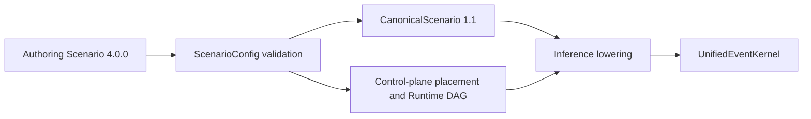

# HeteroLLM Simulator V4 与 Canonical IR 1.1

产品版本：`4.0.0`；Authoring Schema：`4.0.0`；Canonical IR Schema：`1.1`。

## 版本边界

V4 authoring parser 只接受精确的 `schema_version="4.0.0"`。Canonical IR 是独立协议，仍使用 `schema_version="1.1"`；它不随应用 wheel 的版本同步递增。

## 编译边界

Canonical IR 规范化表达硬件、模型 typed DAG、工作负载、并行和部署事实。它不执行旧的手动/自动映射流程，也不在浏览器中重建硬件图。V4 control plane 在运行时形成 placement 及其证据；Canonical 导出保留已解析的部署状态，而不是把一个历史 solver 的声明视为性能结论。

## 控制面语义

控制面 DAG 的节点是聚合的 CPU/controller 工作：容量检查、placement、分配、缓存、NVMe、IOMMU、DMA、PCIe、调度、命令、GPU frontend 与 GPU memory controller。节点有依赖和共享资源容量，因而可表达排队；它们不会被拆为逐指令、逐页或逐 packet 的 IR 节点。

V4 runtime placement 的 fingerprint 为 `runtime-control-plane-v4`。
