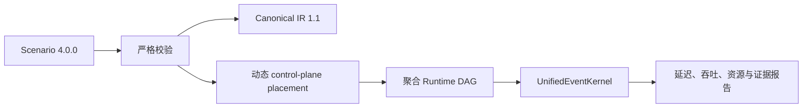

# HeteroLLM Simulator V4 总设计

状态：Living Design

产品版本：`4.0.0`

Authoring Schema：`4.0.0`（仅接受精确版本）

Canonical IR Schema：`1.1`（保持不变）
证据默认值：`ANALYTICAL`

## 产品边界

HeteroLLM Simulator 对 LLM **推理**进行系统级、任务/事务级解析仿真。它用于比较架构与运行时策略，不是训练框架、内核生成器、周期精确 RTL/NoC 仿真器，也不构成性能承诺。

没有训练 IR：输入不接受 loss、backward、gradient、optimizer、checkpoint 或训练数据管线。`ANALYTICAL` 表示资源、依赖、队列和假设已被显式建模；它不代表已针对商用硬件、驱动、模型或服务负载完成校准。

## V4 数据流

`ScenarioConfig` 包含硬件、模型 typed graph、placement、并行、负载、组件成本 profile 和 V4 runtime controller profile。解析器只接受 `schema_version="4.0.0"`；未知字段、旧字段和缺失/错误版本都 fail-closed。V3 JSON 只能通过显式离线导入器转换，正常解析器没有兼容入口。

Canonical IR `1.1` 是 authoring 输入与 lowering 间的稳定规范边界。它保留硬件图、模型算子/张量图、负载、TP/PP/EP logical rank 和已解析的部署信息；它不是产品版本，故不随 V4 升为 `4.0.0`。

## 动态 control plane

V4 移除了用户可操作的手动/自动映射公开工作流。控制面在当前场景上形成动态 DAG，依次表达：

1. 系统容量核算和 placement 决策；
2. allocation、CPU control-cache 与 host page-cache 查询；
3. 可选 NVMe 权重/状态读取、IOMMU 地址翻译、DMA 映射与 PCIe 传输；
4. 批次和算子调度、命令构建与命令提交；
5. GPU command processor、MMU/TLB、L2 和 VRAM controller；
6. 到 GPU 计算 lowering 的因果交接。

容量、组件类型和拓扑可达性是硬约束。placement 决策的求解墙钟时间只作为证据，不会被直接加进模拟时间。控制面会将生成的 placement 与状态保存为 `placement.metadata.control_plane`，旧的 `placement.metadata.auto_mapping` 仅可由 V3 导入器迁移为历史证据，不能恢复旧工作流。

## 聚合粒度与控制器 profile

Runtime IR 在**批次和控制器事务**粒度建模：`InstructionBatch` 表示一组同类指令，`ControllerTransactionBatch` 表示一个 controller 的一组事务，RuntimeAction 表示阶段完成。它不会扩展为每条 CPU 指令、缓存行、页、DMA descriptor 或 NVMe/PCIe packet。该限制保证报告是系统级排队分析，而不是微架构或 packet-level 仿真。

V4 runtime profile 明确描述：

- CPU cache/DRAM、内存 channel、请求队列和 batch；
- NVMe/page cache 的页大小、队列、并发数、读写带宽与延迟；
- PCIe lane 带宽、DMA engine/queue 与 IOMMU TLB/page-walk；
- 每张 GPU 的 command processor、硬件队列、MMU/TLB、L2 和 VRAM controller。

这些 profile 的带宽、延迟、队列深度和并发度用于服务时间与共享资源容量；除非另行引入适用范围、holdout 验证和 calibration profile，它们均为分析性输入，不是校准结果。

## 执行与报告

模型 graph 仍是权威、typed、可执行定义。GEMM、element-wise、reduction、memory 和 communication 分别计量；GPU/HBM、CPU/Host Memory、DMA、链路、NVMe/HBF/SSD 及数字 SRAM-CIM 可共同竞争资源。KV Cache/Offload、Chunked Prefill、连续批处理、抢占和模型内 MTP 继续通过确定性离散事件语义降低。

`RetentionPolicy`（retention policy）定义观察保留方式：`exact`、`streaming` 与 `aggregate` 不是不同模拟器；它们不能被解读为 cycle、silicon 或硬件实测准确度。三种策略都执行同一个 `UnifiedEventKernel`，报告应保留 schema、输入指纹、假设、资源统计与 evidence status。
